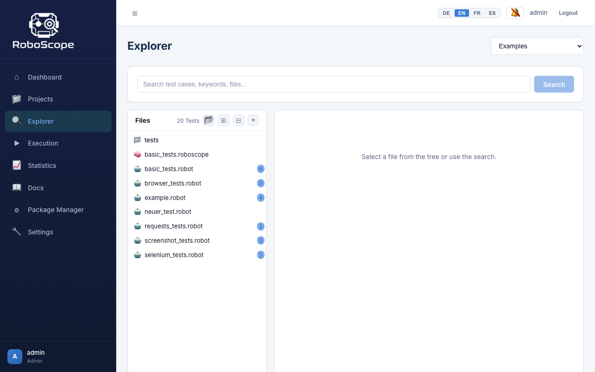
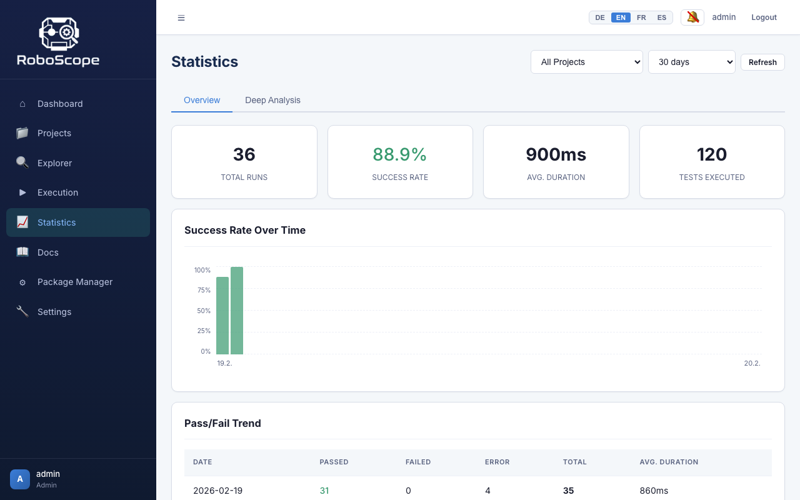

# RoboScope

[](LICENSE)
[](https://github.com/viadee-internal/roboscope/actions/workflows/build.yml)
[](https://github.com/viadee-internal/roboscope/actions/workflows/e2e.yml)

Web-based Robot Framework Test Management Tool with Git integration, GUI execution, report analysis, environment management, and container runtime.

Built by [viadee Unternehmensberatung AG](https://www.viadee.de).


## Features

- **Project Management** — Clone Git repos or link local folders, branch management, auto-sync
- **Test Explorer** — Browse test files, parse Robot Framework keywords/tests, library dependency check
- **Test Execution** — Run tests via subprocess or Docker, live WebSocket status updates, scheduling
- **Environment Management** — Create Python virtual environments, install/manage packages, set variables
- **Report Analysis** — Parse `output.xml`, compare runs, view embedded HTML reports
- **AI-Powered Analysis** — LLM-based failure root-cause analysis with fix suggestions (OpenAI, Anthropic, OpenRouter, Ollama)
- **Statistics & KPIs** — Pass rate trends, flaky test detection, heatmaps, deep analysis (15 KPIs in 5 categories)
- **AI Code Generation** — Generate `.robot` files from `.roboscope` YAML specs, reverse-engineer specs from `.robot` files
- **rf-mcp Integration** — Optional Robot Framework keyword knowledge server for enhanced AI suggestions
- **Role-Based Access** — Four roles: Viewer, Runner, Editor, Admin
- **Multi-Language UI** — English, German, French, Spanish
- **In-App Documentation** — Searchable docs with print/PDF export
- **Offline Deployment** — Standalone ZIP with bundled dependencies for air-gapped environments

## Tech Stack

| Layer | Technology |
|-------|-----------|
| Backend | FastAPI, SQLAlchemy 2.0, Pydantic v2, Python 3.12+ |
| Frontend | Vue 3, TypeScript, Pinia, Vue Router, Chart.js, CodeMirror 6, Vite |
| Database | SQLite (default) or PostgreSQL |
| Tests | pytest (~486 tests), Playwright (~29 E2E specs) |
| AI | OpenAI, Anthropic, OpenRouter, Ollama (configurable) |

## Quick Start

### Prerequisites

- Python 3.12+
- Node.js 20+
- No Redis or external services required

### Development

```bash
# Install dependencies
make install

# Copy environment config
cp backend/.env.example backend/.env

# Start backend (port 8000) + frontend (port 5173)
make dev
```

### Docker

```bash
make docker-dev    # Development (SQLite)
make docker-up     # Production (PostgreSQL + Nginx)
```

### Standalone Deployment

Download the latest `roboscope.zip` from [Releases](../../releases), then:

```bash
unzip roboscope.zip
cd roboscope
./install-mac-and-linux.sh       # Creates venv, installs dependencies offline
./start-mac-and-linux.sh         # Starts server at http://localhost:8000
```

On Windows, use `install-windows.bat` and `start-windows.bat` instead.

Default login: `admin@roboscope.local` / `admin123`

## Screenshots

| Dashboard | Test Explorer | Statistics |
|-----------|--------------|------------|
|  |  |  |

## Project Structure

```
RoboScope/
├── backend/          # FastAPI application
│   ├── src/          # Source code (domain-driven modules)
│   │   ├── auth/     # JWT auth + RBAC
│   │   ├── repos/    # Git repository management
│   │   ├── explorer/ # File browser + Robot parser
│   │   ├── execution/# Test runs + scheduling
│   │   ├── environments/ # venv + packages
│   │   ├── reports/  # output.xml parser + comparison
│   │   ├── stats/    # KPIs + deep analysis
│   │   ├── ai/       # LLM integration (generate, reverse, analyze)
│   │   └── settings/ # App settings
│   ├── tests/        # pytest tests
│   ├── migrations/   # Alembic (SQLite + PostgreSQL)
│   └── examples/     # Example Robot Framework test files
├── frontend/         # Vue 3 + TypeScript SPA
│   └── src/
│       ├── views/    # 12 application views
│       ├── stores/   # 9 Pinia stores
│       ├── api/      # 9 Axios API clients
│       ├── docs/     # In-app documentation (EN, DE, FR, ES)
│       └── i18n/     # Translations (EN, DE, FR, ES)
├── e2e/              # Playwright end-to-end tests
├── docker/           # Dockerfiles and nginx config
├── scripts/          # Build and utility scripts
└── Makefile          # All common commands
```

## API

Swagger UI available at `http://localhost:8000/api/v1/docs`

| Endpoint | Description |
|----------|-------------|
| `/api/v1/auth` | Authentication & user management |
| `/api/v1/repos` | Project CRUD & Git sync |
| `/api/v1/explorer/{repo_id}` | File browser, test parser, library check |
| `/api/v1/runs` | Test execution & scheduling |
| `/api/v1/environments` | Virtual environments & packages |
| `/api/v1/reports` | Report parsing & comparison |
| `/api/v1/stats` | KPIs, trends, deep analysis |
| `/api/v1/ai` | AI providers, code generation, failure analysis |
| `/api/v1/settings` | Application settings (admin) |

## Testing

```bash
make test-backend       # Backend unit tests (pytest)
make test-frontend      # Frontend unit tests (Vitest)
make test-e2e           # Playwright E2E tests
make test               # All tests
make lint               # Ruff + ESLint + vue-tsc
```

## Building

```bash
# Build standalone offline distribution
bash scripts/build-mac-and-linux.sh

# Output: dist/roboscope.zip (includes wheels for Linux, macOS, Windows)
```

## Configuration

| Variable | Default | Description |
|----------|---------|-------------|
| `DATABASE_URL` | `sqlite:///./roboscope.db` | Database connection |
| `SECRET_KEY` | `dev-key` | JWT secret (change in production!) |
| `RUNNER_TYPE` | `auto` | `subprocess`, `docker`, or `auto` |
| `DEFAULT_TIMEOUT_SECONDS` | `3600` | Timeout per test run |
| `WORKSPACE_DIR` | `~/.roboscope/workspace` | Git repos directory |
| `REPORTS_DIR` | `~/.roboscope/reports` | Report files directory |
| `VENVS_DIR` | `~/.roboscope/venvs` | Virtual environments directory |

## Contributing

Contributions are welcome! Please:

1. Fork the repository
2. Create a feature branch (`git checkout -b feature/my-feature`)
3. Commit your changes (`git commit -m 'feat: add my feature'`)
4. Push to the branch (`git push origin feature/my-feature`)
5. Open a Pull Request

Please follow the existing code style (Ruff for Python, ESLint for TypeScript) and include tests for new features.

## License

Licensed under the [Apache License 2.0](LICENSE).

Copyright 2026 [viadee Unternehmensberatung AG](https://www.viadee.de).

## Acknowledgments

- [Robot Framework](https://robotframework.org/) — The test automation framework
- [rf-mcp](https://github.com/manykarim/rf-mcp) by Many Kasiriha — Robot Framework keyword knowledge server
- Built with [FastAPI](https://fastapi.tiangolo.com/), [Vue.js](https://vuejs.org/), and [Playwright](https://playwright.dev/)
