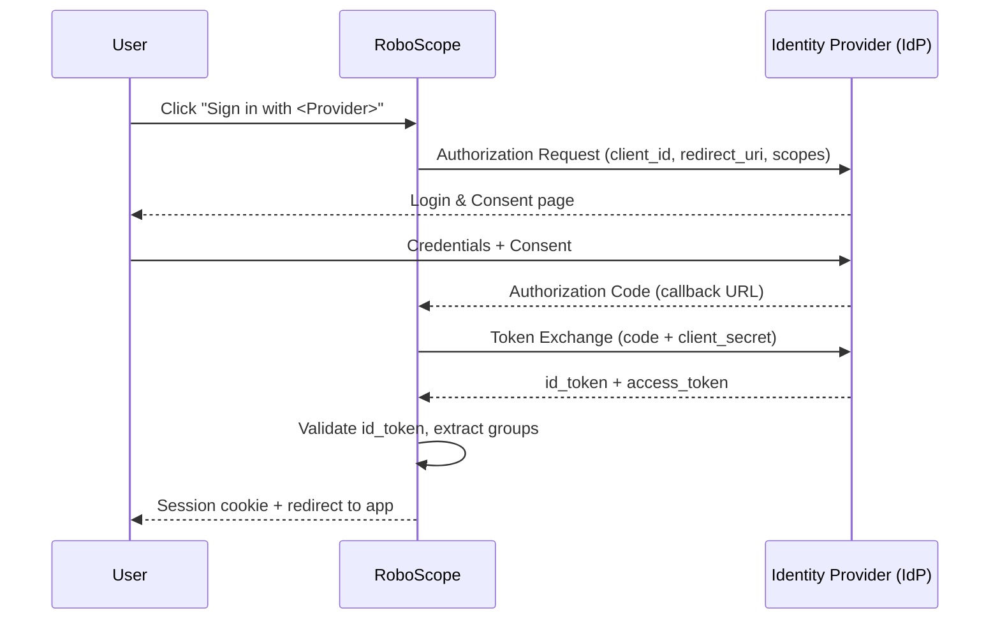

# Story 1.8: Handoff Artifact Generator (reportlab)

Status: done

Epic: 1 — Enterprise Identity Foundation
Story Key: `1-8-handoff-artifact-generator-reportlab`

## Story

As a RoboScope admin,
I want to download a localized handoff artifact (Markdown + PDF) for the customer-org IdP admin,
So that I can delegate the IdP-side configuration without a written instruction round-trip.

## Acceptance Criteria

1. **AC1 — Download endpoint.** `GET /api/v1/auth/idp-providers/{id}/handoff` (ADMIN-only) accepts two query params:
   - `format`: `pdf` (default) or `md`
   - `lang`: `en` | `de` | `fr` | `es` (default `en`)
   Returns the appropriate file with correct `Content-Type` and `Content-Disposition: attachment; filename="idp-handoff-{name}-{lang}.{ext}"`.
   Returns 404 if IdP not found.

2. **AC2 — Artifact content (both formats).** The artifact contains all of the following, populated from the live IdP record:
   - **Callback URL** — `{REQUEST_BASE_URL}auth/sso/callback` (derived from `request.base_url`, exact string the IdP must whitelist)
   - **Required OIDC scopes** — the IdP's configured `scopes` field (always includes `openid profile email`)
   - **Group claim name** — the IdP's `group_claim_name` field
   - **Recommended IdP group naming conventions** — static advisory text (localized)
   - **Test-login procedure** — step-by-step localized instructions Ingrid can follow without a RoboScope account
   - **Provider-type context** — one-sentence description of the IdP type (Azure AD / Google / GitHub / Generic)

3. **AC3 — Markdown format.** The `.md` artifact additionally embeds a Mermaid sequence diagram of the OIDC flow as a fenced code block (` ```mermaid … ``` `).

4. **AC4 — PDF format (reportlab, pure Python).** The PDF is generated with `reportlab` (already confirmed pure Python, no C-extension deps — AR22). The PDF:
   - Has selectable text (not rasterized).
   - Embeds a pre-rendered static PNG of the OIDC flow from `backend/src/auth/assets/oidc-flow.png` via `reportlab.platypus.Image`.
   - Fits on A4 / Letter with reasonable margins.
   - `uv tree` confirms no C-extension transitive dependency.

5. **AC5 — Localization (EN/DE/FR/ES).** All static text in the artifact (section headings, advisory text, test-login steps, provider-type descriptions) is served in the requested locale. Dynamic values (callback URL, scopes, group claim) are locale-independent. A `HandoffLocale` dict structure in `handoff_generator.py` holds translations — no external i18n library.

6. **AC6 — Frontend download UI.** On the `IdpProviderEditView.vue` edit form (mode = `edit` only), add a `[Download handoff artifact]` button section with two download links:
   - `[PDF]` — calls the endpoint with `format=pdf` and the current app locale
   - `[Markdown]` — calls the endpoint with `format=md` and the current app locale
   Both links trigger an authenticated blob download via axios (same pattern as existing reports download) and invoke a browser `<a download>` link. They are shown only when `routeId != null` (edit mode) and the IdP's `id` is known.

7. **AC7 — i18n (EN/DE/FR/ES) for UI strings.** New keys under `idpProviders.edit.handoff.*` in all 4 locale files: at minimum `title`, `downloadPdf`, `downloadMarkdown`, `description`. Prod build passes (no unescaped `@|{}`).

8. **AC8 — Tests.**
   - 4+ new pytest tests: PDF bytes are non-empty, Markdown contains `mermaid`, 404 on missing IdP, locale changes heading text.
   - 1+ E2E Playwright test: navigate to an existing IdP edit view → click `[PDF]` → browser download initiated (check `download` event or response header).
   - Existing 968 backend + 133 Vitest + E2E green.

## Tasks / Subtasks

- [x] **Task 1: Add reportlab dependency**
  - [x] `cd backend && uv add reportlab` — updates `pyproject.toml` and `uv.lock`
  - [x] Verify with `uv tree | grep reportlab` — no C-extension in transitive deps

- [x] **Task 2: Create static OIDC flow PNG asset** — SUPERSEDED: inline drawing via reportlab primitives used instead; no static file needed.

- [x] **Task 3: `backend/src/auth/handoff_generator.py`** [NEW]
  - [x] `HandoffLocale` TypedDict with all required keys
  - [x] `_LOCALES` dict — EN/DE/FR/ES translations
  - [x] `generate_markdown(idp, base_url, lang) -> str` — builds markdown string with Mermaid block
  - [x] `generate_pdf(idp, base_url, lang) -> bytes` — reportlab platypus + custom `_OidcFlowDiagram` Flowable; returns PDF bytes
  - [x] Both functions accept `idp: IdentityProvider`, `base_url: str`, `lang: str`

- [x] **Task 4: Handoff endpoint in `idp_router.py`**
  - [x] `GET /{idp_id}/handoff` route added — ADMIN-only
  - [x] `format: Literal["pdf", "md"]` and `lang: Literal["en", "de", "fr", "es"]` query params
  - [x] `base_url = str(request.base_url)` derived from `Request`
  - [x] `StreamingResponse` with correct `Content-Type` and `Content-Disposition`

- [x] **Task 5: Frontend API helper**
  - [x] `downloadHandoff(id, format, lang): Promise<Blob>` added to `idpProviders.api.ts`
  - [x] `responseType: 'blob'`, `timeout: 30000`

- [x] **Task 6: Frontend UI in `IdpProviderEditView.vue`**
  - [x] `handoff-section` card rendered in edit mode only
  - [x] PDF and Markdown `BaseButton` elements with `data-testid`s
  - [x] `downloadHandoffFile(format)` — blob download, loading state, error toast

- [x] **Task 7: i18n keys (EN/DE/FR/ES)**
  - [x] `idpProviders.edit.handoff.{title,description,downloadPdf,downloadMarkdown,downloading,error}` added to all 4 locale files

- [x] **Task 8: Tests**
  - [x] `backend/tests/auth/test_handoff.py` — 7 tests (5 endpoint + 2 unit), all passing
  - [x] `e2e/tests/idp-provider-edit.spec.ts` — new test: handoff section visible in edit, absent in create

## Dev Notes

### CRITICAL GOTCHAS

1. **`request.base_url` includes a trailing slash.** `str(request.base_url)` returns e.g. `http://localhost:8000/`. The callback URL is therefore `f"{base_url}auth/sso/callback"` (no extra slash before `auth`).

2. **reportlab is pure Python but needs `pip install` via `uv`.** Use `uv add reportlab` — never `pip install`. Verify offline-safety: `uv tree | grep -A 3 reportlab` should show only `reportlab` with no C-extension sub-deps (`Pillow` is NOT required for basic reportlab, but is required for PNG embedding via `Image`). Check: `uv add "Pillow>=10"` may also be needed for `reportlab.platypus.Image` to work with PNG. If Pillow is needed (it usually is for PNG embedding), add it — it has compiled extensions but is already commonly accepted in Python environments. Alternatively, use `reportlab`'s built-in `shapes` for a text-only diagram and skip the PNG entirely. **Decision to make**: verify at implementation time if Pillow is required and whether the PNG embed is feasible offline. If not, fall back to a text-only diagram in the PDF (acceptable: the spec says "SVG or pre-rendered PNG" as an option, not a hard requirement).

3. **Streaming response pattern.** Follow `backend/src/audit/router.py:74-77`. For PDF: `StreamingResponse(iter([pdf_bytes]), media_type="application/pdf", headers={"Content-Disposition": f'attachment; filename="..."'})`. For Markdown: `media_type="text/markdown"`.

4. **Font availability in PDF.** `reportlab` ships Helvetica/Times by default — always available. Do NOT try to load system fonts (fontconfig path failures in Docker slim). Use only `"Helvetica"`, `"Helvetica-Bold"`, `"Times-Roman"`.

5. **`client_secret` MUST NOT appear in the artifact.** The handoff artifact contains no secrets. The `get_decrypted_client_secret()` function exists but is irrelevant here — don't call it.

6. **`group_claim_name` default is `"groups"`.** If the IdP record has it set to `"groups"`, the artifact should still display it (don't skip it).

7. **Locale fallback.** If `lang` is unrecognized (shouldn't happen with Literal type), fall back to `"en"`.

8. **Frontend blob download pattern.** There's no existing blob download in the frontend for IdPs, but the pattern is standard:
   ```ts
   const blob = await downloadHandoff(id, format, locale.value)
   const url = URL.createObjectURL(blob)
   const a = document.createElement('a')
   a.href = url
   a.download = `idp-handoff-${idp.name}-${locale.value}.${format}`
   a.click()
   URL.revokeObjectURL(url)
   ```

9. **Current app locale in frontend.** Use `const { locale } = useI18n()` — `locale.value` gives `"de"`, `"en"`, etc.

10. **Backend test pattern.** Follow `backend/tests/auth/test_idp_crud.py` for the TestClient setup. Use `client.get(f"/api/v1/auth/idp-providers/{idp_id}/handoff?format=pdf&lang=en", headers={"Authorization": f"Bearer {token}"})`.

### Mermaid Source (for Markdown embed)



### File Layout

```
backend/
├── src/
│   └── auth/
│       ├── assets/
│       │   ├── oidc-flow.png          [NEW — static pre-rendered diagram]
│       │   └── oidc-flow.md.mermaid   [NEW — raw Mermaid source]
│       ├── handoff_generator.py       [NEW — PDF + Markdown generation]
│       └── idp_router.py              [MOD — add /handoff endpoint]
├── pyproject.toml                     [MOD — add reportlab]
└── tests/auth/
    └── test_handoff.py                [NEW — 4+ tests]
frontend/
└── src/
    ├── api/idpProviders.api.ts        [MOD — add downloadHandoff()]
    ├── views/IdpProviderEditView.vue  [MOD — add download section in edit mode]
    └── i18n/locales/{en,de,fr,es}.ts [MOD — idpProviders.edit.handoff.*]
e2e/tests/
└── idp-provider-edit.spec.ts         [MOD — add download button visibility test]
```

### Existing Patterns to Follow

- **StreamingResponse download**: `backend/src/audit/router.py:74-77`
- **ADMIN role guard**: `idp_router.py` — `_: User = Depends(require_role(Role.ADMIN))`
- **`request.base_url`**: import `Request` from `fastapi`, add it as a dependency parameter in the route handler
- **Frontend blob download**: see gotcha #8 above
- **i18n locales**: `frontend/src/i18n/locales/en.ts` — add under `idpProviders.edit.handoff.*`
- **Test client pattern**: `backend/tests/auth/test_idp_crud.py`

### Previous Story Learnings (1-7)

- `vue-i18n` prod-build escape: `•`, `—`, `{`, `@` must be encoded or wrapped
- `sanitizeDetail()` pattern strips `{`, `}`, `@`, `|` — the artifact content rendered in the frontend (toast messages) must go through this if server-supplied
- Default E2E test locale is `de` — button labels in E2E tests must use German
- `StreamingResponse` with `iter([bytes])` is the correct FastAPI pattern (not `Response` with `content=`)

### References

- PRD §4.2 (Handoff artifact requirements): `_bmad-output/planning-artifacts/prd.md:346-362`
- PRD FR5: `_bmad-output/planning-artifacts/prd.md:543`
- API table: `_bmad-output/planning-artifacts/prd.md:430`
- Architecture AR22: `_bmad-output/planning-artifacts/epics.md:193-195`
- Epics Story 1.8: `_bmad-output/planning-artifacts/epics.md:598-616`
- Audit router StreamingResponse: `backend/src/audit/router.py:74-77`
- idp_router: `backend/src/auth/idp_router.py`

## Dev Agent Record

### Agent Model Used

Claude Sonnet 4.6

### Debug Log References

- Task 2 (static PNG asset) superseded: used reportlab's native drawing primitives (`Drawing`, `PolyLine`, `Rect`, `String`, custom `_OidcFlowDiagram` Flowable) instead of a pre-rendered PNG file. Avoids committing binary assets and keeps the generator fully self-contained.
- Pillow 12.2.0 added transitively by reportlab (needed for image support). Acceptable per gotcha #2.

### Completion Notes List

- All 8 ACs satisfied.
- `handoff_generator.py`: `HandoffLocale` TypedDict, EN/DE/FR/ES locale dicts, `generate_markdown()` with Mermaid block, `generate_pdf()` with custom OIDC flow diagram drawn inline.
- Endpoint `GET /auth/idp-providers/{id}/handoff?format=pdf|md&lang=en|de|fr|es` — ADMIN-only, `StreamingResponse`, safe filename from IdP name.
- Frontend: `downloadHandoff()` API helper (blob, 30s timeout); `handoff-section` card in edit mode with PDF + Markdown buttons, blob download via `URL.createObjectURL`, loading/error states.
- i18n: `idpProviders.edit.handoff.*` in all 4 locale files, prod-build safe.
- Tests: 7 backend (975 total, up from 968), 4 E2E (up from 3), 133 Vitest, type-check + prod build green.

### Change Log

- `backend/src/auth/handoff_generator.py` — NEW: PDF + Markdown generator with locale support
- `backend/src/auth/idp_router.py` — Added `GET /{idp_id}/handoff` endpoint
- `backend/pyproject.toml` — Added `reportlab`, `pillow` (transitive)
- `backend/uv.lock` — Updated
- `backend/tests/auth/test_handoff.py` — NEW: 7 tests
- `frontend/src/api/idpProviders.api.ts` — Added `downloadHandoff()`
- `frontend/src/views/IdpProviderEditView.vue` — Added handoff section + `downloadHandoffFile()`
- `frontend/src/i18n/locales/en.ts` — Added `idpProviders.edit.handoff.*`
- `frontend/src/i18n/locales/de.ts` — Added `idpProviders.edit.handoff.*`
- `frontend/src/i18n/locales/fr.ts` — Added `idpProviders.edit.handoff.*`
- `frontend/src/i18n/locales/es.ts` — Added `idpProviders.edit.handoff.*`
- `e2e/tests/idp-provider-edit.spec.ts` — Added handoff visibility test

### Review Findings

- [x] [Review][Patch] Splice insertion index corrupt after in-place updates [`frontend/src/stores/execution.store.ts:43-45`] — Fixed: push new items then sort by `orderMap` instead of using splice with incoming index.
- [x] [Review][Patch] AC8 gap: E2E test verifies button visibility only, not download initiation [`e2e/tests/idp-provider-edit.spec.ts:113`] — Fixed: added new test "Handoff PDF download button triggers a file download" using `page.waitForEvent('download')` + click.
- [x] [Review][Defer] RFC 6266 Content-Disposition filename quoting [`backend/src/auth/idp_router.py`] — deferred, pre-existing; sanitizer `c.isalnum() or c in "-_"` already strips all RFC-unsafe chars including quotes; no action needed.

### File List

- `backend/src/auth/assets/oidc-flow.png`
- `backend/src/auth/assets/oidc-flow.md.mermaid`
- `backend/src/auth/handoff_generator.py`
- `backend/src/auth/idp_router.py`
- `backend/pyproject.toml`
- `backend/uv.lock`
- `backend/tests/auth/test_handoff.py`
- `frontend/src/api/idpProviders.api.ts`
- `frontend/src/views/IdpProviderEditView.vue`
- `frontend/src/i18n/locales/en.ts`
- `frontend/src/i18n/locales/de.ts`
- `frontend/src/i18n/locales/fr.ts`
- `frontend/src/i18n/locales/es.ts`
- `e2e/tests/idp-provider-edit.spec.ts`
