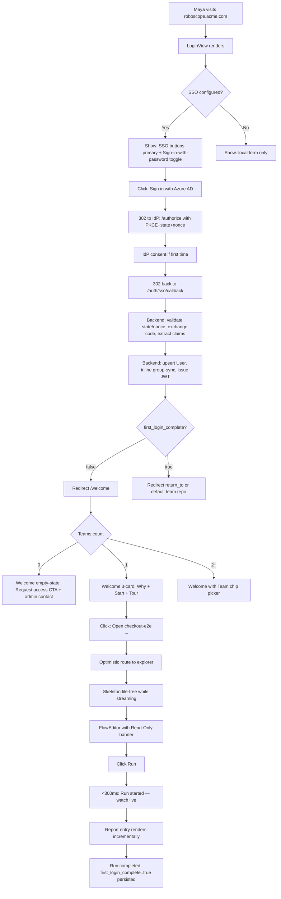
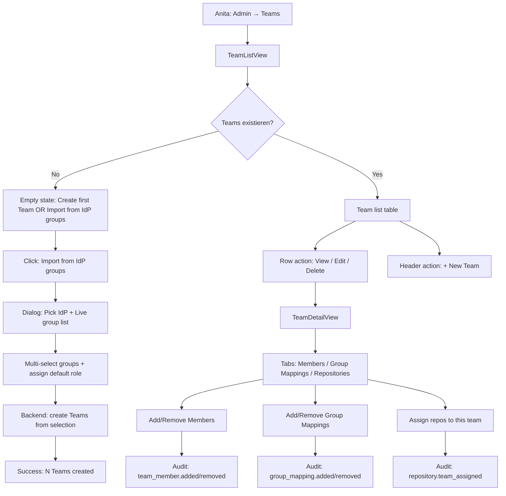
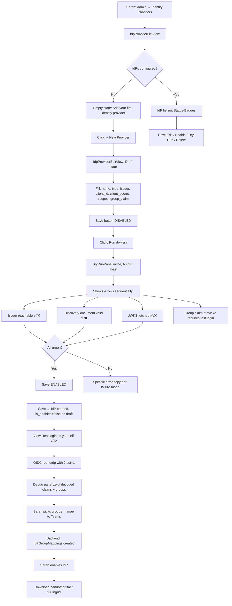
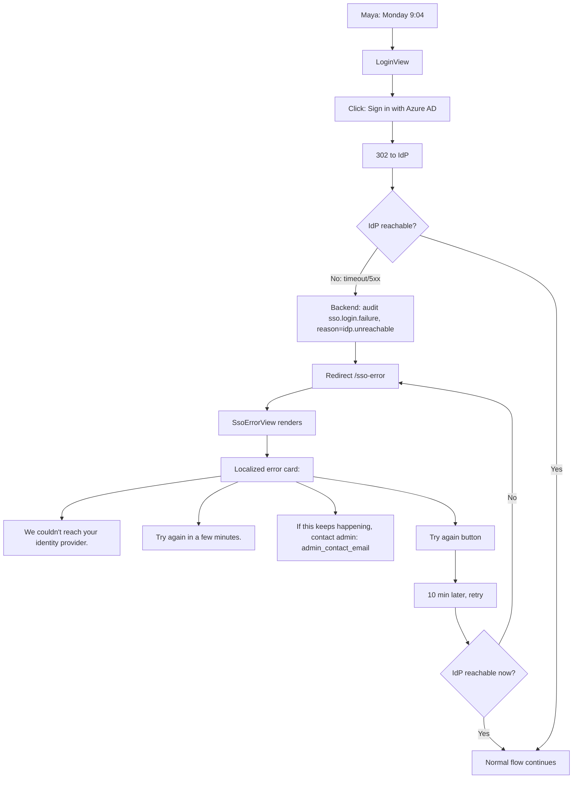
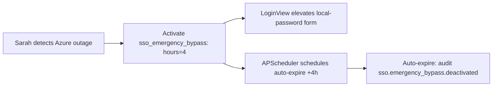
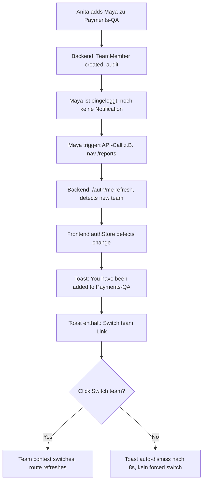
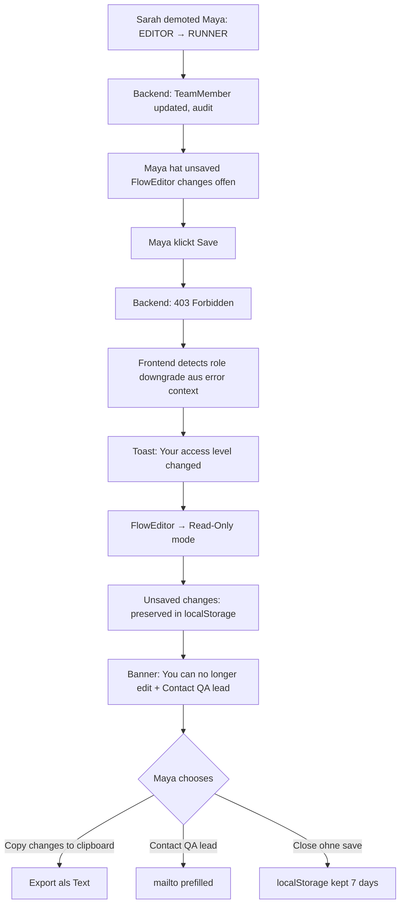

# UX Design Specification — roboscope Phase 4

**Author:** Thomas
**Date:** 2026-04-15

---

<!-- UX design content will be appended sequentially through collaborative workflow steps -->

## Executive Summary

### Project Vision

RoboScope Phase 4 führt OIDC-SSO und ein Teams-Modell ein. Aus UX-Sicht ist diese Phase kein Security-Gate, sondern ein **Inclusion Gate**: non-technische Personas (Tester-neu-in-RF, QA-Lead, PO-im-Hypothesen-Status) sollen durch einen einzigen SSO-Klick in eine bereits visuell verständliche Anwendung (Phase-3 Visual Flow Editor, lesbare Reports) gelangen.

### Target Users

- **Maya — Tester, neu in Robot Framework.** Evaluiert Migration. Skeptisch. Primäre Adoption-Persona. Landet via SSO im Visual Flow Editor (read-only) und klickt Run.
- **Anita — QA Lead, Team-Operator.** Alltäglich aktiv im Team-Management-UI. Frustriert von bisherigen Access-Tickets. Primäre Betriebs-Persona.
- **Sarah — RoboScope-Admin (IT/Security).** Einmalige IdP-Konfiguration + Delegation an Anita. Misstraut Happy-Paths, braucht Dry-Run vor Commit.
- **Maya-Redux — bei IdP-Outage.** Kein Admin-Wissen; sieht "Login kaputt", braucht Verständnis-und-Handlungspfad ohne Jargon.
- **Paul — PO/PM** (Hypothesis-Persona, PRD Appendix A). Keine v1-UX-Investition; Validierungsmetrik 60 Tage post-GA.

### Key Design Challenges

1. **Login-Dualität:** SSO primär, lokales Passwort immer verfügbar aber visuell sekundär — ohne Sarahs Bootstrap-Admin-Pfad zu verstecken.
2. **Inclusion-Moment beim First-Login:** 3-Card-Welcome (Your Teams / Start Here / Tour) statt Dashboard-Tombstone. Das "Why you have access"-Microcopy als emotionaler Anker.
3. **Distrust-zentrierte Admin-Experience:** Dry-Run-Output vor Save sichtbar, strukturierter Report statt Toast.
4. **Read-Only-Affordances** für VIEWER im bestehenden FlowEditor ohne das Editor-Gefühl zu beschädigen.
5. **Outage-Error aus User-Perspektive**, lokalisiert, mit Admin-Kontakt-Oberfläche.
6. **9 Empty/Error-States** explizit designen (enumeriert in PRD Journey Requirements Summary).
7. **WCAG 2.1 AA** auf allen neuen Flächen; Amber-Kontrast (`#D4883E`) im Review sicherstellen.

### Design Opportunities

1. **"Why you have access"-Microcopy** im First-Login-Welcome — niedrigster Entwicklungsaufwand, höchster emotionaler Effekt.
2. **Wiederverwendbares `DryRunPanel.vue`** — Strukturierter Report mit ✅/⚠️/❌-Zeilen, pre-Save sichtbar.
3. **IdP-Groups-als-Picker** in allen Group-Mapping-Flows statt Freitextfeld.
4. **Nahtloses Einfügen in existierendes Design-System:** Navy-Header, Steel-Blue-CTAs, Amber-Accent für "needs attention", driver.js-Tour bereits integriert — kein visueller Reset nötig.

### Existing Design-System (Referenz, nicht zu re-entscheiden)

Aus `frontend/src/assets/styles/main.css`, `CLAUDE.md`, bestehenden Views:

- **Typografie:** Inter, 14 px base, Headings `--color-navy` mit `letter-spacing: -0.3px`
- **Farben:** Primary `#3B7DD8`, Accent `#D4883E`, Navy `#1A2D50`, Success `#37996E`, Danger `#DC3545`
- **Radius:** 6/10/14 px
- **Shadows:** 3-stufig subtil (`sm`/`md`/`lg`)
- **Base-Components:** `BaseButton`, `BaseBadge`, `BaseModal`, `BaseSpinner`, `BaseToast`
- **Utility-Klassen:** `.card`, `.form-input`, `.data-table`, `.status-badge`, `.page-header`, `.grid-{2,3,4}`
- **Animationen:** Shake bei Error, fade/slide 0.15–0.2 s ease
- **Tour-Library:** driver.js mit `.roboscope-tour-popover`-Styling integriert
- **Layout:** Sidebar 250 px + Header 56 px; Breakpoints 1024/768 px

## Core User Experience

### Defining Experience

Die zentrale Phase-4-Interaktion ist **"Sign in and understand what you can see"**. Ein Klick auf einen SSO-Button muss den Nutzer in unter 60 Sekunden in einer Anwendung landen lassen, deren Zugang sich erklärt — welche Teams er hat, warum, was er dort tun kann — ohne Admin-Konsole, Doku-Seite oder Support-Ticket.

**Sekundäre Kern-Experiences:**

- **"Configure an IdP with zero regret"** — Sarahs Dry-Run-Before-Save-Moment.
- **"Onboard your team by clicking groups, not typing names"** — Anitas Import-from-IdP-Groups-CTA.

### Platform Strategy

- **Web-only** (Vue 3 SPA). Keine Mobile-App in Phase 4.
- **Desktop-primär für Admin-Flows** (Sarah, Anita) — Dry-Run-Panel + Team-Management brauchen Fläche.
- **Tablet/iPad-kompatibel für Read-Flows** (Maya öffnet Report, Paul öffnet Report im Sprint-Review) — kein dediziertes Mobile-Layout, aber bestehende Breakpoints (1024/768 px) bleiben verbindlich für alle neuen Views.
- **Keyboard-First** für Login und Admin-UI (NFR24). Mouse-Interaktion ergänzend.
- **Offline:** Anwendung funktioniert offline (Core Invariant). SSO-Flow ist online; Outage-Verhalten (Maya-Redux) ist eine Kern-Journey, nicht ein Edge-Case.

### Effortless Interactions

1. **SSO-Login.** Ein Klick. Die Seite zeigt maximal 1–3 SSO-Buttons (je konfigurierten Providern) + eine dezentere "Sign in with password"-Toggle. Keine Registrierung, keine Forgot-Password-Dance für SSO-User.
2. **Gruppe-zu-Team-Mapping.** Sarah und Anita sollen **nie IdP-Gruppen-Namen tippen**. Die UI holt die Liste aus dem letzten Dry-Run oder Login und bietet sie als Picker an.
3. **Repo-zu-Team-Assignment.** Einfacher Team-Selector in den Repo-Settings — Erweiterung einer bestehenden View, keine neue Fläche.
4. **"Why you have access"-Erklärung.** Erscheint automatisch ohne Klick beim First-Login. Maya muss nie "Warum bin ich in diesem Team?" fragen.
5. **Bookmark-zurück-zur-Report-URL.** Session-Expiry wird zum unsichtbaren Redirect-Dance (FR12). Paul bookmarkt `/reports/1234`, kommt Tage später wieder, sieht `/reports/1234`.

### Critical Success Moments

1. **Erste Sekunden nach SSO-Callback.** First-Login-Welcome-Screen ist *der* Make-or-Break-Moment. Fail-State = "leere Dashboard-Kacheln" → Maya bounct. Success-State = "Du bist in `Checkout-QA` weil `checkout-testers` in Azure AD" + EIN klarer nächster Schritt.
2. **Dry-Run-Report bei IdP-Config.** Der Moment, in dem Sarah statt "trust me bro Save-Button" einen ✅/⚠️/❌-Report sieht. Entscheidet, ob sie RoboScope vertraut.
3. **Outage-Error-Screen.** Der Moment, in dem Maya nicht in Panik gerät oder Support spammt. Success = eine Zeile: "Try again in a few minutes, contact sarah@acme.com if it persists."
4. **Import-from-IdP-Groups-Button-Klick.** Anita sieht ihre echten IdP-Gruppen aufgelistet statt eines leeren Formulars. Das ist der "oh, das ist ja trivial"-Moment, der ihre Begeisterung für das gesamte Feature bestimmt.

### Experience Principles

1. **Explain access, don't just grant it.** Jede neue Zugriffs-Oberfläche (First-Login, Team-Liste, Repo-Details) erklärt *warum* der Nutzer sieht, was er sieht. Nie stumme Access-Magic.
2. **Dry-run before commit, always.** Wo die Anwendung mit externen Systemen (IdPs) spricht, steht Verifizierung vor Persistierung. Save-Button bleibt disabled bis Verifizierung grün ist.
3. **Never ask the user to type what they can pick.** IdP-Gruppennamen, Team-Namen, E-Mail-Adressen — wenn die Anwendung es wissen kann, bietet sie es als Picker an.
4. **Errors are user-facing, not admin-facing.** Fehlermeldungen richten sich immer an die Person vor dem Bildschirm, in ihrer Sprache, mit einer klaren Handlungsanweisung. Tech-Details gehören in AuditLog.
5. **Absence is a non-dead-end.** Jeder leere Zustand (keine Teams, keine Repos, kein SSO konfiguriert) bietet eine sinnvolle nächste Aktion — nie blanker Screen.
6. **Inherit the visual language, don't invent one.** Navy-Header, Steel-Blue-CTAs, Card-Pattern, `.data-table` — Phase-4-Views sind unsichtbar neu, erkennbar RoboScope.
7. **Keyboard-first for admin flows.** Sarah und Anita sind IT-Profis; Tab-Order, Enter-to-Submit, Escape-to-Cancel sind Pflicht.

## Desired Emotional Response

### Primary Emotional Goals

| Persona | Gewünschter Primär-Zustand | Zu vermeidender Zustand |
|---|---|---|
| **Maya (Tester)** | **Belonging** — "ich gehöre hier rein, das ist für mich gebaut" | Isolation, Intimidation, "das ist ein Dev-Tool für andere" |
| **Anita (QA Lead)** | **Empowerment** — "ich kann das alleine, ohne Ticket" | Dependence on IT, Gatekeeping-Frustration |
| **Sarah (Admin)** | **Confidence** — "ich weiß, dass das funktioniert, bevor ich Save klicke" | Skepticism confirmed — "ein weiteres Tool, dem ich nicht trauen kann" |
| **Maya-Redux (Outage)** | **Reassurance** — "das wird gleich wieder gehen, ich kenne den Weg" | Panic, Helplessness, "wen frage ich denn jetzt?" |

### Emotional Journey Mapping

**Maya: Skepticism → Curiosity → Trust**

1. Login-Seite: bekannter Azure-AD-Button → Vertrautheit.
2. Post-Callback-Welcome: "You've been added to Checkout-QA via your Azure AD group" → *Aha, das ist nicht magisch, das ist nachvollziehbar*.
3. Visual-Flow-Editor read-only → *Oh, das ist lesbar, nicht Code*.
4. Run-Klick → *Ich habe was beigetragen, ohne kaputt zu machen*.

**Sarah: Distrust → Verification → Done**

1. IdP-Config-Formular öffnen → Default-Distrust-Mode.
2. Dry-Run-Click → strukturierter ✅/⚠️/❌-Report → *Die Anwendung weiß, was sie tut*.
3. Save → *Keine Angst vor dem Save-Klick*.
4. 3 Monate später, Anita managt alles selbst → *Best tool I adopted this year*.

**Anita: Frustration (mit IT) → Empowerment → Routine**

1. Erster Blick auf Team-Admin → *Das kenne ich aus unserer Doku, da ist was*.
2. "Import from IdP groups" → Live-Liste → *Das ist ja trivial*.
3. Moves a repo between Teams → kein Ticket, kein Warten → *Endlich*.
4. Onboarding-Neuling in Sprint 3 → *Ich muss nix mehr tun, HR hat den Job gemacht*.

**Maya-Redux: Confusion → Reassurance → Patience**

1. Button-Klick → Spinner → Error-Screen.
2. Error-Copy: "We couldn't reach your identity provider. Try again in a few minutes, contact sarah@acme.com" → *Aha, nicht mein Fehler. Ich weiß, was zu tun ist*.
3. 10 min später, funktioniert → *Schon wieder normal*.

### Micro-Emotions

| Micro-Emotion | Wo? | Design-Hook |
|---|---|---|
| **Confidence over Confusion** | Welcome-Card mit "Why you have access" | Explizites Microcopy mit IdP-Group-Namen |
| **Trust over Skepticism** | Dry-Run-Panel vor Save | Strukturierter inline Report statt Toast |
| **Accomplishment over Frustration** | Import-from-IdP-Groups | Live-Picker statt Freitext |
| **Belonging over Isolation** | Read-Only-Banner im FlowEditor | "Read-only — ask an EDITOR to change this" statt stumm disabled |
| **Reassurance over Anxiety** | Outage-Screen | Admin-Kontakt + "try again" + kein Tech-Jargon |
| **Satisfaction over Delight** | Session-Expiry-Redirect | Unsichtbares "back to what you were doing" |

Wir optimieren bewusst **nicht auf Delight** — Phase 4 ist Enterprise-Auth. Delight wäre Misplaced Enthusiasm ("Welcome to Teams! 🎉"). Stattdessen: *quiet competence*.

### Design Implications

1. **Confidence → Explicit Microcopy.** Jeder neue Access-Zustand erklärt sich in einer Zeile. Kein silent "you have access, trust me".
2. **Trust → Structured Verification UI.** `DryRunPanel.vue` mit ✅/⚠️/❌-Zeilen wird zur wiederverwendbaren Komponente. Keine Toasts für Verifikations-Ergebnisse.
3. **Empowerment → Self-Serve-CTAs.** Jeder Admin-Flow endet mit einer konkreten Next-Action-Option, nicht "Speichern und warten".
4. **Belonging → Inclusive Copy.** Read-Only-Banner erklärt *warum*, nicht *was*. Empty-States bieten immer einen Weg nach vorn.
5. **Reassurance → Human Error-Language.** Error-Copy in der Sprache des Nutzers, mit Admin-Kontakt, ohne Error-Codes.
6. **Quiet Competence → Subtle Visual Hierarchy.** Kein Confetti, keine Mega-CTAs, keine Animationen außer den bestehenden fade/slide/shake-Transitions.

### Emotional Design Principles

1. **Enterprise-Auth-UX darf sich wie Consumer-Onboarding anfühlen — ohne Consumer-Tropes.** Keine Welcome-Modal-Takeover, keine Glückwunsch-Animation, aber auch keine bürokratische Kälte.
2. **Distrust ist ein valides Primärgefühl bei Admins.** Design sollte es bestätigen (Verification-UIs), nicht wegerklären.
3. **Non-technische Nutzer sind Gäste, bis sie sich zuhause fühlen.** First-Login-Copy trägt mehr Gewicht als jedes andere UX-Element im Epic.
4. **Fehler sind menschlich, auch wenn sie technisch sind.** Jede Error-Message ist ein Conversation-Moment, keine Stacktrace-Dumping-Opportunität.
5. **Empowerment entsteht durch Picker, nicht durch Anleitungen.** Wo die Anwendung etwas weiß, zeigt sie es direkt; wo nicht, fragt sie gezielt.

## UX Pattern Analysis & Inspiration

### Inspiring Products Analysis

**1. GitHub (Sign-In + Organizations).** Login-Hierarchie (SSO prominent, Password sekundär), Organization-Badge im Header als jederzeit-sichtbarer Kontext, "You've been invited to Organization X"-Inline-Erklärung beim Org-First-Login. **Anti-Pattern:** gelegentliche Product-Tour-Modal-Takeover → Dismiss-Reflex.

**2. Linear (Onboarding + Empty States).** Zero-State-als-Feature ("You're all caught up"), Inline-Tour mit kontextuellen Tooltips statt Takeover, Quiet Confidence ohne Emojis in System-Copy. Direkt anwendbar auf First-Login-Welcome und alle 9 PRD-Empty-States.

**3. Vercel (Team-Switching + Admin-UI).** Team-Switcher als Primary Header-Element mit Avatar+Rolle, Admin-Sub-Navigation-Layout, Inline-Preview bei Config-Changes. Übertragbar auf `TeamSwitcher.vue` und Admin-IdP-Layout.

**4. Stripe (Config-UX + Error-Copy).** "Test Mode" vor "Live Mode" als verbindliche Dry-Run-Semantik, strukturierte Verification-Responses mit grünen Checks und gelben Warnings, Error-Copy ohne Error-Codes im User-Facing-Text. Referenz für FR38-Outage-Copy und `DryRunPanel.vue`.

### Transferable UX Patterns

**Navigation:**

- **Team-Switcher im Header** (Vercel) — primäre Kontext-Anzeige, Picker-Dropdown mit Avatar und Rolle.
- **Admin-Sub-Navigation** (Vercel/Stripe) — linkes Sub-Menü für Identity Providers / Teams / Emergency Bypass, rechts Content.

**Interaction:**

- **SSO-Button-First-Hierarchy** (GitHub) — SSO prominent, Password-Form sichtbar-aber-dezent via Toggle.
- **Live-Picker-statt-Freitext** (Linear, GitHub Teams-Import) — IdP-Groups als Picker im Team-Creation.
- **Inline-Tour-statt-Modal** (Linear) — driver.js mit kontextuellen Tooltips für First-Login.
- **Dry-Run-mit-strukturiertem-Report** (Stripe) — Verifikation vor Commit, ✅/⚠️/❌ pro Check.

**Visual:**

- **Zero-State-als-Feature** (Linear) — leere Team-Liste, leere Repo-Liste, leere Group-Mapping-Liste zeigen einladend-leise Illustration + EIN CTA.
- **Quiet Competence** (Stripe, Linear) — keine Emojis in System-Copy, subtle Micro-Animations.
- **"Why you have access"-Inline-Breadcrumb** (GitHub Org-Invite) — explizite Erklärung bei First-Login in neuen Kontext.

### Anti-Patterns to Avoid

1. **Welcome-Modal-Takeover beim First-Login.** Trainiert Dismiss-ohne-Lesen-Verhalten.
2. **"Tour später wiederholen"-versteckt-in-Settings.** Entweder inline + dismiss-optional, oder gar nicht.
3. **"Your admin configured this"-ohne-Admin-Name.** Sackgasse. Admin-Kontakt muss surface sein (`admin_contact_email`).
4. **Farb-kodierte Errors ohne Icon oder Text** — Barriere für Farbblinde, WCAG-Verletzung.
5. **Toast für kritische Bestätigungen** ("IdP saved" → Toast verschwindet nach 3 s → Sarah unsicher). Strukturierter Inline-Report.
6. **Leere Dashboard-Kacheln beim First-Login.** Tombstones. Maya bounct in 10 Sekunden.
7. **"Invalid grant"-oder-OAuth-Error-Codes im User-UI.** Jargon-Barriere. Codes leben im AuditLog.
8. **Group-Claim-Name als Freitextfeld.** Fehleranfällig — Picker aus Live-Dry-Run-Response.
9. **Session-Expiry-Redirect zu `/dashboard` statt `/return_to`.** Paul bounct.
10. **Over-animation** (Confetti bei Team-Created) — passt nicht zum Enterprise-Tonfall.

### Design Inspiration Strategy

**What to Adopt (1:1 oder nah dran):**

- SSO-Button-First + Password-Toggle (GitHub) → LoginView Redesign
- Team-Switcher im Header (Vercel) → `TeamSwitcher.vue`
- Zero-State-als-Feature (Linear) → alle 9 PRD-Empty-States
- Dry-Run-strukturierter-Report (Stripe) → `DryRunPanel.vue`
- Inline-driver.js-Tour (Linear, bereits im Repo) → First-Login-Tour-Card

**What to Adapt:**

- "Why you have access"-Microcopy (GitHub Org-Invite): ohne Avatar, nur Text-Zeile mit IdP-Group-Referenz
- Admin-Sub-Navigation (Vercel): minimal, nur "Identity Providers" / "Teams" / "Emergency Bypass"
- Stripe-Error-Copy: in 4 Locales, mit Admin-Kontakt statt "Docs-Link"

**What to Avoid:**

Modal-Takeover, Confetti, Toast-für-kritische-Bestätigungen, Freitext-wo-Picker-möglich, OAuth-Error-Codes-user-facing, leere Dashboard-Kacheln beim First-Login.

## Design System Foundation

### Design System Choice

**Custom Design System, bereits etabliert — Phase 4 erweitert, ersetzt nicht.**

RoboScope hat ein funktionierendes Custom Design System auf Basis von `frontend/src/assets/styles/main.css` (CSS Custom Properties + Utility Classes) und 5 Base-Komponenten (`BaseButton`, `BaseBadge`, `BaseModal`, `BaseSpinner`, `BaseToast`). Phase 4 wird nicht auf MUI/Ant/Tailwind-UI migriert.

### Rationale for Selection

1. **Offline-first Constraint.** Externe Design-System-Libraries bringen oft Dependencies mit Google-Fonts, CDN-Icons oder Laufzeit-Abhängigkeiten — verbotenes Terrain laut Projekt-Invariante. Custom bleibt die einzige saubere Option.
2. **Brand-Konsistenz bereits bewiesen.** Die bestehenden 12 Views folgen einer klaren Designsprache (Navy-Header, Steel-Blue-CTAs, Amber-Accent, Card-Pattern). Phase 4 fügt sich nahtlos ein.
3. **Moderate Scope** (7 neue Views + 2 Komponenten + 1 Prop) lässt sich mit bestehenden Utility-Klassen erzeugen.
4. **Vue-Native + CSS-Variablen** sind schneller iterierbar als ein externes Framework mit Theme-Override-Layer.
5. **Accessibility-Tooling trivial integrierbar:** `@axe-core/playwright` funktioniert unabhängig vom Design-System.

### Implementation Approach

**Zero neue Design-System-Dependencies.** Phase 4 konsumiert:

- Existierende CSS-Variablen (`main.css`): Farben, Radius, Shadows, Layout.
- Existierende Utility-Klassen: `.card`, `.form-input`, `.data-table`, `.form-label`, `.status-badge`, `.page-header`, `.page-content`, `.grid-*`, `.form-group`.
- Existierende Base-Components: `BaseButton`, `BaseBadge`, `BaseModal`, `BaseSpinner`, `BaseToast`.
- Existierende Animations (fade, slide, shake-on-error).
- Existierende Tour-Library (driver.js mit `.roboscope-tour-popover`-Styling).

**Neue wiederverwendbare Komponenten (Teil dieses Epic):**

1. **`DryRunPanel.vue`** — Strukturierter Verification-Report mit ✅/⚠️/❌-Zeilen. Konsumiert `.card` + `.status-badge`.
2. **`TeamSwitcher.vue`** — Header-Komponente, Picker-Dropdown.
3. **`useCanEdit`-Composable** — Nicht visual, aber Design-System-relevant als zentrale Read-Only-Decision-Logik.

**Extensions zum bestehenden System (kleine, additive Ergänzungen):**

- `.sso-provider-button` — Button-Variante für SSO-Login-Buttons (scoped in `LoginView.vue`).
- `.read-only-banner` — Utility-Klasse für Read-Only-Affordances.
- `.welcome-card` — Card-Variante für First-Login-3-Card-Layout.
- `.error-card--outage` — Outage-spezifischer Error-Card-Style.

**Neue Icon-Needs (alle SVG inline, offline-bundled):**

- SSO-Provider-Icons: Azure AD, Google, GitHub — monochrom für UI-Konsistenz.
- Verification-Status: Unicode ✅ ⚠️ ❌ + SVG-Fallback für WCAG-Konformität.
- Team-Avatar-Placeholder: initialen-basiertes generiertes Avatar.

### Customization Strategy

**Farben — keine neuen Primärfarben, aber neue semantische Rollen:**

| Farbe | Bestehend | Phase-4-Rolle |
|---|---|---|
| `--color-primary` `#3B7DD8` | CTA, Focus-Rings | SSO-Buttons, Primary Admin-Actions |
| `--color-accent` `#D4883E` | Warnings | "Needs attention" — Expired Discovery Cache, Emergency Bypass aktiv, Dry-Run-Warning |
| `--color-success` `#37996E` | Passed-Status | Dry-Run ✅, SSO-Login success |
| `--color-danger` `#DC3545` | Failed-Status | Dry-Run ❌, SSO-Failure |
| `--color-navy` `#1A2D50` | Sidebar, Headings | First-Login-Welcome-Text |

**⚠️ Kontrast-Audit nötig:** `--color-accent` `#D4883E` auf weißem Hintergrund ist WCAG-AA für Large Text (>18 pt), aber **nicht für Body-Text**. Für Amber-on-White in kleinen Fonts → `--color-accent-dark` `#A66A2E` verwenden. Als Teil der A11y-Story (NFR23) explizit prüfen.

**Typografie — keine Änderungen.** Inter, 14 px base, Headings in `--color-navy` mit `letter-spacing: -0.3px`.

**Spacing & Radius — keine Änderungen.**

**Dark Mode — Status quo.** RoboScope hat keinen Dark Mode. Phase 4 führt keinen ein.

**Responsive Design — existierende Breakpoints bindend:**

- 1024 px: Tablet — Admin-Views und Dry-Run-Panel müssen lesbar bleiben.
- 768 px: Mobile — primär Read-Only-Kontext (Report-Views); Admin-UI ist "best effort".

### Design-System-Governance

- Neue globale CSS-Klassen → PR gegen `main.css` mit Review durch Frontend-Owner.
- Neue Base-Components → PR gegen `components/ui/` mit Dokumentation.
- View-lokales Styling → scoped `<style>` im SFC, nicht global.
- Token-Änderungen (neue CSS-Variable) → RFC-Diskussion, nicht stillschweigend.

## Defining Experience

### The Defining Moment — reframed per Party-Mode round

**Die definierende Interaktion ist "the security reviewer's trust moment"**: die ersten 60 Sekunden nach dem ersten SSO-Callback eines Users sind der sichtbare Beweis, dass Phase 4 das liefert, was das PRD verspricht — ein procurement-reviewed Enterprise-Login *ohne Friction*. Wenn diese 60 Sekunden sauber sind, ist die PRD-These empirisch bestätigt. Wenn sie bröckeln, verliert RoboScope genau die Deals, die Phase 4 überhaupt gewinnen soll.

*Das ist nicht dasselbe wie "Inclusion Gate ist der UX-Held".* Inclusion bleibt ein Bonus-Effekt derselben Mechanik, nicht die These. PM-Scope-Creep im Narrativ vermieden (per John).

**Primäre Daily-Use-Persona ≠ Defining-Experience-Persona:**
- Defining Experience → **Maya** (einmal pro User, hoher Impact auf Trust-Moment).
- Daily Use → **Anita** (QA Lead, operiert Teams täglich — 90 % der Phase-4-User-Sekunden).

Der 3-Card-Welcome ist für Maya optimiert; alles danach (Team-CRUD-Flows, Role-Resolution-UI, Edge-Cases) ist für Anita. Die UX-Investition ist entsprechend gewichtet: Welcome ist polish-wertig, *nicht* über-polierbar; der größere UX-Zeit-Etat fließt in Team-Management-Flows (User Journeys, Step 10).

### User Mental Model

**Maya kommt mit:**
- "Neues Dev-Tool. Muss mich wohl registrieren."
- "Ich werde verloren sein."
- "Das braucht Code, den ich nicht habe."

**Und prallt auf:**
- Kein Registrieren — gewohnter SSO-Button.
- Kein leerer Zustand — Team ist bereits zugeordnet, Erklärung dabei.
- Kein `.robot`-Code — Visual Flow Editor zeigt Test als Flussdiagramm.

**Kritische Erwartungen der anderen Personas:**
- **Anita:** "ich kenne solche Admin-Tools; wenn es gut ist, muss ich nicht fragen wo was ist."
- **Sarah:** "Config → Test → Save, in dieser Reihenfolge."
- **Maya-Redux:** "Der Button hat nicht funktioniert. Ist das meine Schuld oder die des Tools?"

### Success Criteria — honest time budget

**Kern-Prinzip: "No dead air, always progressing."** Nicht "<60s Wall-Clock", sondern **jede Sekunde hat einen sichtbaren Fortschritt** (Skeleton, inline-streaming, Button-Spinner, Welcome-Card-Render) und nie > 1 s ohne visuellen Indicator.

**Messbare Milestones (P50 unter normalen Enterprise-Netzwerk-Bedingungen):**

| Zeitpunkt | Erwarteter State | Kommentar |
|---|---|---|
| **t = 0 s** | Callback landet auf `/welcome`; Welcome-Card vollständig gerendert | Backend muss Team-Membership im Callback-Handler resolven und inline in Response mitgeben — **nicht** nachladen. |
| **t ≤ 3 s** | Maya liest "Why you have access"-Zeile und versteht | Load + Read. |
| **t ≤ 10 s** | Maya hat Primary-CTA im Blick und klickt | Decision Point. |
| **t ≤ 20 s** | **Repository-File-Tree sichtbar** (nicht Flow Editor vollständig!) | Demoted per Party Mode — Vue-Flow-Cold-Load ist nicht 20-s-garantierbar ohne Pre-Warm. |
| **t ≤ 30 s** | Flow Editor gerendert mit Read-Only-Banner | Realistischer Cold-Start-Zeitpunkt. |
| **t ≤ 45 s** | Run-Click, < 300 ms "Run started"-Feedback (NFR2) | Feedback-Lag ist inakzeptabel. |
| **t ≤ 60 s** | Erster Report-Eintrag rendert (Status-Indicator, Run kann noch laufen) | Incremental rendering. |

**P50-Qualifier:** Die Milestones gelten für Median-Bedingungen (Azure-AD hot, IdP-Discovery-Cache warm, corporate WiFi). Slow-Network / Cold-Caches / First-Callback-After-Deploy rechtfertigen 2× Budget — wichtig: **keine Dead-Air-Regression** unter schlechten Bedingungen.

**Pre-Warming als Phase-4-Anforderung (neu, aus Party Mode):**
- Wenn eine Team-Mitgliedschaft via IdP-Group-Sync erstellt wird, triggert das einen Best-Effort-Pre-Warm des Teams-most-active-Repositories (git-clone oder pull) ⇒ dokumentieren als optionale neue Story in Architektur-Implementation-Sequence (#7 Team-Model).
- Alternative, wenn nicht realisierbar: t ≤ 20 s-Milestone bleibt bei "File-Tree sichtbar", nicht "Flow Editor vollständig".

**Success-Indicators pro Persona:**
- **Maya:** Kommt am nächsten Tag wieder.
- **Anita:** Keine Helpcenter-Suche bei erster Team-CRUD-Aktion.
- **Sarah:** Speichert erste IdP-Config ohne Angst.
- **Maya-Redux:** Flucht nicht, wartet 10 min, klickt erneut.

### Novel vs. Established Patterns

**Established (kein Lernaufwand, direkt übernehmen):**
- SSO-Button-First-Hierarchy (GitHub).
- Team-Switcher im Header (Vercel).
- OIDC Authorization Code Flow mit PKCE (Standard).
- Card-based Layout (Stripe/Linear).

**Novel (brauchen minimale Erklärung):**
- **"Why you have access"-Inline-Breadcrumb** beim First-Login. Rare im Enterprise-Auth-Kontext. Unser Twist: IdP-Group-Referenz als labeled metadata line statt eingebetteter Participle-Clause (per Paige — siehe Welcome-Copy).
- **Dry-Run-vor-Save als Pflicht-Gate** (nicht Optional). Save-Button disabled bis Dry-Run grün. Lern-Moment für Sarah: ein Tooltip reicht.

### Experience Mechanics — First 60 Seconds After SSO

**1. Initiation (t = –2 s):**
Browser → `/auth/sso/callback?code=…&state=…`. Backend: Code-Exchange + Claim-Extraction + inline-transaktionaler Group-Sync (NFR3). **Neue Anforderung:** Callback-Handler lädt Team-Membership und Default-Team-ID **vor** Redirect, gibt sie in `GET /auth/me`-Cache mit. Redirect zu `/welcome` wenn `first_login_complete=false`, sonst zu `return_to` oder Default-Team-Repo.

**2. Interaction (t = 0–20 s):**

Welcome-Card-Layout — 3 Sections, *dekorativ entfernt* (keine Card-Borders, nur generöser Whitespace + subtiler Left-Border-Accent pro Section), Hierarchie **1 > 2 >> 3**:

**Section 1 (primary, prose-ton, Amber-Left-Accent):**
```
Welcome, Maya.

You've been added to Checkout-QA.
Source: Azure AD group `checkout-testers`
This gives you Runner access to 6 repositories.

[View your team →]
```
Copy-Pattern per Paige: Statement + labeled metadata line. Dynamische Werte (`Checkout-QA`, `checkout-testers`, `6`) via `<i18n-t>`-Slots, nicht in `$t()`-Templates. **Kein 👋**.

**Section 2 (center, mit Illustration, equal-weight zum Primary-CTA):**
```
Ready to start?

Jump into your team's main repository: checkout-e2e
Last run: 2h ago

[Open checkout-e2e →]   [Browse all 6 repos]
```
Copy-Pattern: "main" statt "most-active" (Paige). Team-Lead-pinnable Starter-Repo mit most-active als Fallback (Sally). Grund-Microcopy ("Last run: 2h ago" oder "Your team lead pinned this") macht Recommendation nachvollziehbar. Bei ≥ 20 Repos: Browse-CTA wird zu "[Search your 20 repos →]".

**Section 3 (bottom, visibly de-emphasized, smaller font, inline link-row):**
```
New to RoboScope?  [60-second tour]  ·  [Skip for now]
```
Tour nur gezeigt wenn `tour_completed=false`.

**3. Feedback (t = 10–45 s):**
- Button-Klick auf "Open checkout-e2e": optimistisches Routing + Button-Spinner (keine Dead-Air).
- Repo-Explorer-Skeleton während File-Tree-Streaming.
- Flow-Editor mit Read-Only-Banner wenn `effective_role < EDITOR`.
- Run-Click → < 300 ms persistent In-Flight-Indicator.

**4. Completion (t = 45–60 s):**
- Report rendert inkrementell.
- `first_login_complete=true` persistiert.
- `/welcome` bleibt erreichbar über `?welcome=1`-Query, aber Default-Redirect landet auf `return_to` oder Default-Team-Repo.

### Fail-States (complete set, per Sally's Party-Mode feedback)

| # | State | UX-Behavior |
|---|---|---|
| 1 | **Maya hat 0 Teams** (Zero-Teams-Fallback, FR34) | Section 1: "Welcome, Maya. You're signed in, but you haven't been added to a team yet." + `[Request access from sarah@acme.com]` + optional Demo-Repo-Link. |
| 2 | **Maya ist in >1 Team, kein Default** | Section 1 zeigt alle Teams als Chips: "You're in Checkout-QA, Payments-QA, and Platform-QA. Which one today?" Section 2 adaptiert basierend auf Auswahl. **Kein arbiträres Alphabetisch-Erste-Team**. |
| 3 | **Teams hat 50+ Repos, kein Pin, keine Activity** | Section 2: "Your team has 50 repositories. [Search repos] [Browse recent activity]". Keine arbiträre Auswahl. |
| 4 | **Team hat 0 Repos** (provisioned-but-empty) | Section 2: "Your team hasn't added any repositories yet. [Message your team lead] [Browse public repos]". |
| 5 | **Group-Claim → kein gemapptes Team** (Admin-Mapping-Lag) | Section 1: "Your Azure AD group `checkout-testers` isn't mapped to a RoboScope team yet. An admin needs to finish setup. [Notify admin]". |
| 6 | **Tour bereits abgeschlossen** (`tour_completed=true`) | Section 3 wird nicht gerendert. Kein nerviger "Would you like a tour?"-Prompt. |
| 7 | **Slow Network / Pre-Warm nicht fertig bis t = 10 s** | Open-CTA: optimistic routing, Skeleton-File-Tree, kein Dead-Click. |
| 8 | **SSO-Outage beim Re-Login** (Maya-Redux) | Redirect zu `/sso-error`-View (separate Route). Lokalisierter Error, Admin-Kontakt, "try again"-Button. |
| 9 | **Maya ist VIEWER, klickt Run im FlowEditor** | Run-Button disabled-with-tooltip: "You need RUNNER role — ask your QA lead". |

### UX Gaps — Addressable in Later Steps (per John's Party-Mode list)

Die folgenden Gaps sind aus Party Mode notiert und werden in späteren UX-Steps (User Journeys, Component Strategy, UX Patterns) oder im Epic-Breakdown adressiert. Hier als Awareness-Backlog:

1. **SSO-Failure-UX-Detail-States.** Wenn der IdP 500s, SAML-Assertion malformed ist, User in IdP aber nicht in RoboScope existiert — Design-Variants pro Error-Code. Aktuell nur `/sso-error`-Generic-View spezifiziert.
2. **Role-Transition mid-session.** Admin demotet User von EDITOR zu VIEWER während User aktive Tabs offen hat. Silent-403s sind Vertrauensbruch. **Lösung:** Frontend pollt `effective_roles` bei jeder Repo-Navigation + Zeigt Toast bei Downgrade.
3. **"Added to new team while logged in".** Muss der User ausloggen und wieder einloggen? **Lösung:** Nein — Backend inkludiert neue Teams in nächstem `/auth/me`-Refresh; Frontend zeigt subtile Notification: "You've been added to Payments-QA. [Switch team →]".
4. **Empty-State für den zweiten User einer Org.** Erster Admin landet auf `/welcome`-Equivalent. Zweiter User (ganze Org hat noch 0 Teams, 0 Repos) — was sieht er? Deckt teilweise Fail-State #1 ab, aber braucht eigenständige Behandlung in User Journeys.
5. **SSO + API-Token-Coexistenz bei Deprovision.** Wenn Maya deprovisioniert wird, ihr CI-Pipeline-Token aber noch läuft — UX-Pfad für Token-Reassign-an-Active-User. Architektonisch in FR44 adressiert; UX-Detail in Admin-View fehlt noch.

Diese fünf Gaps werden explizit in **Step 10 (User Journeys)** und **Step 11 (Component Strategy)** aufgegriffen — nicht in diesem Step, damit Step 7 fokussiert bleibt.

### Experience Principles (locked)

1. **No dead air.** Jede Sekunde hat einen sichtbaren Fortschritt — Skeleton, Streaming, Button-Spinner, Render. Nie > 1 s unbeantwortet.
2. **Explain access, don't just grant it.** "Why you have access"-Microcopy ist nicht verhandelbar.
3. **Pre-commit verification.** Wo die Anwendung mit IdPs spricht, steht Verification vor Persistierung.
4. **Picker over free-text.** Wo wir etwas wissen, bieten wir es an.
5. **Errors are user-facing.** Tech-Details gehen ins AuditLog.
6. **Absence is a non-dead-end.** Jeder leere Zustand bietet eine sinnvolle nächste Aktion.
7. **Inherit the visual language.** Phase-4-Views sind unsichtbar neu, erkennbar RoboScope.
8. **Keyboard-first for admin flows.** Sarah und Anita sind IT-Profis.
9. **Daily-use over first-use.** UX-Investment folgt der tatsächlichen User-Zeit-Verteilung — Anitas Team-CRUD bekommt mehr Design-Aufmerksamkeit als Mayas `/welcome`.

## Visual Design Foundation

### Color System

Phase 4 erzeugt keine neue Foundation — wir konsolidieren hier nur Phase-4-spezifische Anwendungen der existierenden Palette aus `main.css`.

| Token | Hex | Semantische Rolle in Phase 4 |
|---|---|---|
| `--color-primary` `#3B7DD8` | Steel Blue | SSO-Buttons, Primary-CTAs, Focus-Rings |
| `--color-primary-dark` `#2A5FA8` | Darker Blue | Hover-States auf SSO-Buttons |
| `--color-primary-bg` `#EBF3FD` | Lightest Blue | Section-1-Highlight im Welcome-Card |
| `--color-accent` `#D4883E` | Warm Amber | Emergency-Bypass-Active-Indicator, Expired-Discovery-Cache-Warning, Dry-Run-⚠️ |
| `--color-accent-dark` `#A66A2E` | Darker Amber | **Body-Text-Ersatz wo Kontrast auf Weiß kritisch ist** |
| `--color-success` `#37996E` | Green | Dry-Run ✅, SSO-Login-Success |
| `--color-danger` `#DC3545` | Red | Dry-Run ❌, SSO-Failure, Outage-Error |
| `--color-navy` `#1A2D50` | Navy | Welcome-Headings, Admin-Headings, Sidebar |
| `--color-text-muted` `#5A6380` | Muted | Metadata-Lines, Code-Highlights |
| `--color-text-light` `#8E96B0` | Light | Tertiary Link-Row (Tour-Section 3) |

**Phase-4-spezifische Farb-Anwendungen (keine neuen Tokens):**

- **SSO-Provider-Buttons:** weiße Base + `--color-border`; Provider-Logo farbig. Kein Provider-spezifischer Button-Background — Neutralität im Enterprise-Tonfall.
- **Emergency-Bypass-Active-Banner:** `--color-accent-bg` + `--color-accent-dark` Text + `--color-accent` Left-Border. Im Header sichtbar solange aktiv.
- **Read-Only-Banner:** `--color-primary-bg` + `--color-text-muted` Text + Info-Icon. Informativ, nicht alarmierend.
- **Expired-but-usable Discovery-Cache-Indicator:** `--color-accent` Badge "Cache expired, last fetched 25h ago".

### ⚠️ Kontrast-Audit (NFR23 WCAG 2.1 AA)

**Problembereich:** `--color-accent` `#D4883E` auf weißem Hintergrund hat Kontrastverhältnis ~2.9:1.

- ✅ Ausreichend für **Large Text** (≥ 18 pt regular / 14 pt bold) — WCAG-AA-Threshold 3:1
- ❌ Unzureichend für **Body Text** (< 18 pt regular) — Threshold 4.5:1

**Phase-4-Regel:**

- `--color-accent` ist erlaubt für **Badges, Icons, Borders, Headings ≥ 18 pt**.
- Für **Body-Text auf Weiß immer `--color-accent-dark` `#A66A2E`** (Kontrast ~5.2:1, WCAG-AA für Body).

Als Teil der A11y-Story automatisiert verifiziert via `@axe-core/playwright`.

**Farbblindheit:** Kritische Zustände (Dry-Run ✅/⚠️/❌) immer mit Icon + Label, nie nur Farbe. Label ist immer redundant zur Farbe.

### Typography System

Unverändert aus existierendem System:

- **Primary Face:** Inter, 14 px base, 1.6 line-height.
- **H1:** 24 px, weight 700, `--color-navy`, letter-spacing -0.3 px.
- **H2:** 20 px, weight 700, `--color-navy`.
- **H3:** 16–18 px, weight 600.
- **Body:** 14 px regular, `--color-text`.
- **Muted-Metadata:** 12–13 px, `--color-text-muted`.
- **Tertiary Links (Tour-Row):** 12 px, `--color-text-light`.

**Phase-4-Anwendung:**

- **Welcome-Section-1-Headline:** "Welcome, Maya." — H2-Size (20 px), `--color-navy`.
- **Metadata-Lines** ("Source: Azure AD group `checkout-testers`"): 13 px, `--color-text-muted`. Group-Namen in `<code>`-Tag mit Mono-Font-Stack.
- **Dry-Run-Row-Labels:** 13 px; weights gemäß Severity.
- **SSO-Provider-Button-Text:** 14 px, weight 500, `--color-text`.

### Spacing & Layout Foundation

Unverändert aus existierendem System:

- **Base-Unit:** 4 px (`.gap-1` = 4, ... `.gap-6` = 24).
- **Card-Padding:** 20 px Standard, 14 px Mobile.
- **Page-Content-Padding:** 24 / 16 / 12 px (Desktop/Tablet/Mobile).
- **Sidebar-Width:** 250 px (nicht applicable für Login/Welcome).
- **Header-Height:** 56 px.

**Phase-4-Deltas:**

- **Welcome-Card max-width:** 480 px zentriert — gleiche Dimension wie `.login-card`. Cozy, nicht dashboardig.
- **Welcome-Sections-Separation:** `.gap-6` (24 px) zwischen Section 1 / 2 / 3.
- **Tour-Link-Row (Section 3):** `.gap-4` Top-Padding + `border-top` für Trennung.
- **Dry-Run-Panel:** stacked rows, `.gap-2` (8 px) zwischen Rows, Icon-Width fixed 24 px.
- **Admin-IdP-Edit-Form:** 2-Column-Grid auf Desktop (`.grid-2`), single column auf Tablet.

### Layout Principles

1. **Welcome-Layout ist intentional cozy, not dashboard.** Max-width 480 px, vertikal gestapelt, zentriert.
2. **Admin-Layouts nutzen volle Page-Content-Breite.**
3. **Forms nutzen 2-Column auf Desktop, single column auf Tablet und kleiner.**
4. **Tables immer `.table-responsive` gewrapped.**
5. **Modal-Dialogs nur für Destructive-Actions** (Delete Team, Delete IdP), nie für Konfigurations-Flows.

### Accessibility Considerations (NFR22–25)

1. **Color-Contrast:** Alle Phase-4-Combinations ≥ WCAG 2.1 AA. Automatisiert via `@axe-core/playwright`.
2. **Keyboard Navigation:** Alle Login-, Welcome-, Admin-, Team-Views voll tastaturbedienbar. Tab-Order explizit in Admin-IdP-Edit.
3. **Focus-Indicators:** Existing `--color-primary` 3 px Focus-Ring auf allen interactive Elements.
4. **`aria-label` in 4 Locales:** SSO-Provider-Buttons, Dry-Run-Status-Icons, Emergency-Bypass-Banner, Read-Only-Banner, Team-Switcher-Dropdown.
5. **Screen-Reader-Text:** Icon-only-Buttons bekommen `aria-label` + visible Tooltip.
6. **Semantische HTML:** `<section>` mit `<h2>`, nicht `<div>`-Suppe. Admin-Sub-Nav via `<nav>`.
7. **Reduced Motion:** Respektiert `@media (prefers-reduced-motion: reduce)`.
8. **Form-Labels:** Explizit `<label for/id>`, nie nur Placeholder.
9. **Error-Announcements:** Login-Errors und Dry-Run-Failures via `role="alert"` + `aria-live="assertive"`.

### Phase-4-Visual-Cheatsheet

| UI-Element | Token-Stack |
|---|---|
| Welcome-Section-1 | `.welcome-card` + `--color-primary-bg` bg, `--color-accent` left-border 4 px |
| SSO-Provider-Button | `.sso-provider-button` + `--color-primary` on hover/focus |
| Dry-Run ✅-Row | `--color-success` icon + default text |
| Dry-Run ⚠️-Row | `--color-accent` icon + `--color-accent-dark` text |
| Dry-Run ❌-Row | `--color-danger` icon + text |
| Read-Only-Banner | `.read-only-banner` + `--color-primary-bg` bg, `--color-text-muted` text |
| Emergency-Bypass-Active | `.bypass-banner` + `--color-accent-bg` bg, `--color-accent-dark` text |
| Error-Card (Outage) | `.error-card--outage` + `--color-danger-bg` bg, admin-contact email prominent |
| Team-Switcher (Header) | chip-style dropdown + user-avatar + team-name + role-badge |

## Design Direction Decision

### Chosen Direction: "Quiet Enterprise with Prose Warmth"

Ein einzelner Design-Ansatz, direkt abgeleitet aus:

- Existing Design System (Steel Blue / Navy / Amber, Card-based, Inter-Typografie)
- Emotional Goals (*quiet competence*, nicht Delight)
- Inspiration-Strategy (GitHub + Linear + Vercel + Stripe — adapt, nicht kopieren)
- Defining Experience (Welcome als *security reviewer trust moment*, Anita als Daily-Use-Persona)

### Was die Direction definiert

1. **Layout:** Card-based, single-column für First-Login (max-width 480 px), volle Page-Content-Breite für Admin-Flows, 2-Column-Grids für Forms auf Desktop.
2. **Interaction-Stil:** Keyboard-first für Admin, Mouse-ergänzend. < 300 ms-Feedback-Guarantee auf CTAs. Nur bestehende fade/slide/shake-Transitions.
3. **Visual-Weight:** Hell-dominiert (weiße Cards auf `--color-bg`), Navy-Sidebar als Kontext-Anker, Amber-Accent exklusiv für "needs attention"-States.
4. **Navigation-Pattern:** Bestehende Sidebar + Header + neuer Team-Switcher als chip-style Dropdown im Header.
5. **Komponenten:** Bestehende Base-Components + `DryRunPanel` + `TeamSwitcher` + `ReadOnlyBanner` (Util-Klasse).
6. **Brand-Alignment:** 100 %. Keine Brand-Dissonanzen, keine Consumer-Tropes.

### Warum *ein* Ansatz statt mehrerer Varianten

- **Brownfield-Constraint:** Visuelle Konsistenz mit den 12 bestehenden Views ist wichtiger als Differenzierung zwischen Phase-4-Views.
- **Low-Contrast-Design-Territory:** Enterprise-Auth-UX hat wenig echte visuelle Design-Choices — Entscheidungen liegen in Copy, Timing, Empty/Error-States (in Step 7 adressiert).
- **UX-Zeit-Budget:** Zeit besser investiert in Component-Strategy und User-Journeys.

### Implementation Approach

Alle sieben Phase-4-Views als direkte Extensions des existierenden Visual-Systems:

1. `LoginView.vue` — Erweiterung, SSO-Buttons über bestehendem Form, "Sign in with password"-Toggle.
2. `FirstLoginView.vue` — Neu, reuse `.login-card`-Chrome mit drei Prose-Sections.
3. `SsoErrorView.vue` — Neu, reuse `.login-card` + `.error-card--outage`.
4. `IdpProviderListView.vue` — Neu, reuse `.page-content` + `.data-table`.
5. `IdpProviderEditView.vue` — Neu, reuse `.page-content` + `.grid-2` + neuer `DryRunPanel`.
6. `TeamListView.vue` / `TeamDetailView.vue` — Neu, reuse `.page-content` + `.data-table`.
7. `TeamSwitcher.vue` — Neu-Component im Header.

### Iteration-Strategie

Design wird nicht in Figma oder HTML-Mockup vorgebaut, sondern direkt in Vue + CSS implementiert und iteriert:

- **Sprint 1:** Login + FirstLogin + SsoErrorView live auf Dev.
- **Sprint 2:** Admin-IdP + DryRunPanel live.
- **Sprint 3:** Team-Management + TeamSwitcher live.
- Playwright-Screenshot-Test pro Sprint als visuelle Regression gegen manuell approved Referenz.
- Design-Review an live-app-Screenshots, nicht Mockups.

### Ausstehende Detail-Entscheidungen (Step 11 oder Sprint 1)

- Exaktes Wording der Welcome-Card-Prose (Paige-Pass).
- SSO-Provider-Icons: SVG-Quellen und exakte Farben.
- Team-Switcher-Dropdown-Layout: Single-Row-Chips vs. Avatar-Name-Role-Stacked.

## User Journey Flows

### Journey 1: Maya — First SSO Login → Running a Test



**Key UX-Entscheidungen:**

- **Optimistic Routing** bei Klick auf "Open checkout-e2e" — Navigation passiert sofort, Skeleton zeigt Progress, File-Tree streamt ein.
- **Read-Only-Banner vor Run-Interaction** — Maya sieht den Banner bevor sie versucht zu editieren.
- **`first_login_complete` wird bei erstem Run oder expliziter Dismiss gesetzt**, nicht bei `/welcome`-Browser-Close.

### Journey 2: Anita — Daily Team-CRUD (Primary Daily-Use Flow)



**Key UX-Entscheidungen:**

- **TeamDetailView mit Tabs** statt separater Sub-Routes.
- **Live-Picker für Group-Import** konsumiert die Dry-Run-Group-Liste — kein zweiter IdP-Roundtrip.
- **Destructive Actions** (Remove Member, Delete Mapping) mit Confirm-Modal; Edit-Actions inline.
- **Zero-Teams-Empty-State** hat zwei gleichwertige CTAs.

### Journey 3: Sarah — One-Time IdP Config with Dry-Run Distrust



**Key UX-Entscheidungen:**

- **Save disabled bis Dry-Run grün** — visuell gesperrt mit Erklärung, nicht versteckt.
- **DryRunPanel inline** als Teil der Edit-View, nicht Modal, nicht Toast.
- **Test login as yourself** separater Step nach Save (Polish-Feature).
- **Handoff-Artifact-Download** via `reportlab` (Markdown + PDF).

### Journey 4: Maya-Redux — IdP Outage (User's Perspective)



**Parallel admin-side flow (unsichtbar für Maya):**



**Key UX-Entscheidungen:**

- **User-Perspektive ausschließlich** — keine OAuth-Codes im User-UI.
- **`admin_contact_email` aus Settings** — dynamisch, Fallback "your administrator".
- **Try-Again-Button** triggert erneut `/auth/sso/{idp_id}/login` — kein Retry-State-Complexity.
- **Emergency-Bypass ist unsichtbar für Maya** — lokale Form wird einfach prominenter, wenn aktiv.

### Journey 5 (Gap-Closure): Added-to-New-Team While Logged In



**Key UX-Entscheidungen:**

- **Kein forced Re-Login.** Frontend-Toast + optionaler Team-Switch.
- **Lazy detection** bei nächstem API-Call — kein Polling.
- **8 s Toast-Duration** (länger als Default-3 s).

### Journey 6 (Gap-Closure): Role Downgrade Mid-Session



**Key UX-Entscheidungen:**

- **Changes preserved in localStorage** — kein Datenverlust durch stilles 403.
- **Explicit Banner** statt nur Toast — Kontext bleibt sichtbar.
- **mailto-Link** nutzbar wenn Admin-Kontakt oder Team-Lead-Info verfügbar.

### Journey Patterns (extrahiert)

**Navigation:**

1. 302-Redirects für Auth-Flows (Login/Callback), kein SPA-Client-Routing.
2. Optimistic-Route + Skeleton für teure Destination-Loads.
3. Tab-Based Sub-Navigation in Detail-Views.
4. Team-Switcher im Header als globale Kontext-Wahl.

**Decision:**

1. Disabled-with-Explanation statt versteckter UI.
2. Destructive-Confirm für Deletes; inline für Edits.
3. Two-equal-weight-CTAs bei Empty-States.

**Feedback:**

1. Inline-Strukturierter-Report für Verifications.
2. Toast + Persistent-Banner für State-Changes mid-session.
3. Skeleton + Streaming für Lade-States > 500 ms.
4. < 300 ms-Guarantee auf alle CTA-Klicks.

### Flow Optimization Principles

1. **Minimize-Time-to-First-Value.**
2. **Preserve-User-State-Aggressively** — localStorage, bookmarkable URLs, `return_to` überall.
3. **Progressive-Disclosure** — Dry-Run sequentiell, Tabs statt Sprawl.
4. **Graceful-Degradation** — jeder Fail-State hat konkrete Next-Action.
5. **Transparency-Over-Magic** — "Why you have access", "Source: Azure AD group X".

## Component Strategy

### Design System Components (bestehend, wiederverwendet)

| Component | Verwendung in Phase 4 | Änderungen |
|---|---|---|
| `BaseButton` | SSO-Provider-Buttons, Admin-CTAs, Dry-Run-Trigger | Keine |
| `BaseBadge` | IdP-Status, Role-Badge im TeamSwitcher, Dry-Run-Row-Status | Evtl. neue Variant `--amber` für "expired-but-usable" |
| `BaseModal` | Destructive-Confirms (Delete Team, Delete Mapping, Delete IdP) | Keine |
| `BaseSpinner` | Dry-Run running, Login loading, Welcome-Card while team data loads | Keine |
| `BaseToast` | Team-Added-mid-session, Settings-Save-Success, Role-Downgrade-Alert | `duration` prop auf 8 s erweitern für kritische Notifications |

**Utility-Klassen (bestehend):** `.card`, `.card-header`, `.data-table`, `.form-input`, `.form-label`, `.form-group`, `.form-select`, `.form-textarea`, `.status-badge`, `.page-header`, `.page-content`, `.grid-*`, `.table-responsive`, `.text-muted`, `.text-sm`, `.text-lg`, `.text-xl`, `.flex`, `.items-center`, `.gap-*`.

### Custom Components (neu in Phase 4)

#### `DryRunPanel.vue`

**Purpose:** Strukturierter Verification-Report für IdP-Config. Ersetzt Toast-Feedback durch inline sichtbaren mehrzeiligen Report.

**Props:** `result: DryRunResult | null`, `loading: boolean`, `collapsible?: boolean = false`

**States:** Empty, Loading, Complete-All-Green, Complete-With-Warnings, Complete-With-Failures, Stale (wenn Form nach erfolgreichem Dry-Run modifiziert).

**Accessibility:** `role="status"` + `aria-live="polite"`; jede Row mit `aria-label` (z.B. "Issuer reachable: passed, 387 milliseconds"); Tab-Order Header → Rows → Footer-Actions.

**Reusability:** Als `BaseVerificationReport` in Phase 4.5 (SAML) promovierbar.

#### `TeamSwitcher.vue`

**Purpose:** Header-Component, zeigt aktuelles Team + ermöglicht Wechsel bei Multi-Team-Usern.

**Props:** `currentTeamId: number`, `teams: Team[]`, `effectiveRoles: Record<number, Role>`

**States:** Single-Team (statisch), Multi-Team (Dropdown aktiv), Zero-Team (nicht gerendert), New-Team-Added-While-Open (Blink-Indicator + Toast).

**Accessibility:** `role="button"` + `aria-haspopup="menu"` + `aria-expanded`; Arrow-Up/Down im Dropdown; Escape schließt; Enter switched; `aria-current="true"` auf Current-Team.

#### `WelcomeCard.vue`

**Purpose:** First-Login-Welcome, spezifisch für `/welcome`.

**Props:** `user: User`, `teams: Team[]`, `defaultTeamId: number | null`, `starterRepoId: number | null`, `tourCompleted: boolean`

**Events:** `@openRepo(repoId)`, `@startTour()`, `@dismiss()`

**Conditional Sections:** Section 1 immer; Section 2 nur bei `teams.length > 0`; Section 3 nur bei `!tourCompleted`.

#### `IdpProviderForm.vue`

**Purpose:** Dedicated Form für IdP-Config (nicht modal, da DryRunPanel Platz braucht).

**Fields:** `display_name`, `provider_type`, `issuer_url`, `client_id`, `client_secret` (Visibility-Toggle), `scopes`, `group_claim_name`, `redirect_uri` (readonly).

**Actions:** `[Run dry-run]`, `[Save]` (disabled bis Dry-Run grün), `[Cancel]`.

**Validation:** `issuer_url` muss `https://`; `client_id` non-empty; inline.

#### `GroupMappingRow.vue`

**Purpose:** Row-Component für `IdPGroupMapping` in TeamDetailView.

**Modes:** Display / Edit-Role.

**Keyboard:** Enter toggled Display↔Edit; Escape cancelt.

#### `ReadOnlyBanner` (Utility-Klasse)

**Varianten:** `.read-only-banner--viewer`, `.read-only-banner--role-changed`, `.read-only-banner--team-removed`.

**Placement:** Top der Komponente, `position: sticky; top: 0;`.

### Composables (neu)

#### `useCanEdit(repoId: number)`

Returns: `{ canEdit, canRun, role, readOnlyReason }`. Liest `authStore.effective_roles_by_repo[repoId]`.

#### `useSsoProviders()`

Returns: `{ providers, loading, error, refresh }`. Cached in Pinia-Store `sso.ts`.

### Component Implementation Strategy

1. **Zero-Import-Philosophy.** Keine neue External-Component-Library. Alle Custom-Components sind SFCs, styled mit scoped `<style>` + CSS-Variablen.
2. **Base-Component-First.** Neue Features zuerst als Instance bestehender Base-Components versuchen; Custom nur wenn Pattern nicht passt.
3. **Promotion-Path.** Custom-Components werden nach 2× Wiederverwendung als `BaseX` promoviert. `DryRunPanel` ist Phase-4.5-Kandidat.
4. **i18n-Last.** Alle User-facing-Strings in Translation-Keys, Keys in Sprint 1 gelockt, Templates nutzen `$t()` bzw. `<i18n-t>`-Slots für dynamische Values.
5. **Accessibility-By-Default.** Jede neue Component hat WCAG-AA Contrast + `aria-*`-Labels + Keyboard-Navigation von Anfang an.

### Implementation Roadmap

**Sprint 1 (Login + First-Login):**

- `LoginView.vue` Erweiterung (SSO-Buttons + Toggle)
- `WelcomeCard.vue`
- `FirstLoginView.vue`
- `SsoErrorView.vue`
- `useSsoProviders`-Composable
- SSO-Provider-Icons (SVG bundled)
- Translation-Keys gelockt

**Sprint 2 (Admin-IdP + Verification):**

- `IdpProviderListView.vue`
- `IdpProviderEditView.vue`
- `IdpProviderForm.vue`
- **`DryRunPanel.vue`**
- Admin-Sub-Navigation-Layout
- Handoff-Artifact-Download-Button

**Sprint 3 (Team-Management + Read-Only):**

- `TeamListView.vue`
- `TeamDetailView.vue` (Tabs)
- `TeamSwitcher.vue`
- `GroupMappingRow.vue`
- `useCanEdit`-Composable
- `ReadOnlyBanner`-Utility
- `FlowEditor.vue` `readOnly`-Prop
- Emergency-Bypass-Admin-UI

### Acceptance-Gate pro Component

1. Implementation funktional auf Dev.
2. Props/Events dokumentiert (JSDoc im SFC).
3. Unit-Test in `frontend/src/tests/` (Vitest).
4. Playwright-Test erfasst die Component in mindestens einer Journey.
5. `@axe-core/playwright` grün auf der View.
6. Alle Strings in EN/DE/FR/ES (vue-i18n-Prod-Build grün).
7. Screenshot-Regression-Test grün.

## UX Consistency Patterns

### Button Hierarchy

**Primary (CTA):** `BaseButton` default, `--color-primary` bg. **Max. 1 pro Sektion.** Beispiele: "Sign in with Azure AD", "Open checkout-e2e", "Save" (wenn dry-run grün).

**Secondary:** `BaseButton` ghost, transparent bg + `--color-primary` border. Beispiele: "Browse all 6 repos", "Sign in with password" (Toggle), "Cancel".

**Tertiary / Link-Row:** Text-only `--color-primary`, underline-on-hover. Beispiele: "Skip for now", "Back to list", "Contact admin".

**Destructive:** `BaseButton` danger variant, `--color-danger` bg. **Immer in Confirm-Modal-Footer.** Beispiele: "Delete Team", "Remove Member", "Deactivate IdP".

**Disabled:** Opacity 0.5 + `cursor: not-allowed`; **niemals** unsichtbar. Immer mit Tooltip oder Inline-Helptext ("Run dry-run first to enable Save").

**Icon-only Buttons:** `BaseButton` compact + Icon + `aria-label`. Immer Tooltip bei Hover. Beispiele: Copy-Callback-URL, Delete-Mapping-Row, Client-Secret-Visibility-Toggle.

### Feedback Patterns

| Situation | Pattern | Duration |
|---|---|---|
| Transiente Erfolgs-Bestätigung (unkritisch) | `BaseToast` success | 3 s auto-dismiss |
| Transiente Erfolgs-Bestätigung (kritisch) | `BaseToast` success + persistenter Success-Indicator | 8 s + permanent indicator |
| Settings-Change mit Side-Effects (mid-session) | `BaseToast` info + Persistent-Banner | Banner bis Navigation |
| Error: Form-Validation | Inline unter Feld, `--color-danger` + Icon | Persistent bis korrigiert |
| Error: API-Failure (non-fatal) | `BaseToast` danger + Retry-CTA | 8 s + manueller Dismiss |
| Error: Fatal / Blocking | Full-View Error-Screen oder Persistent-Banner | Persistent mit Admin-Contact |
| Verification-Result (Dry-Run) | Inline strukturierter Report, **nie Toast** | Persistent bis Action |
| Loading > 500 ms | Skeleton oder Spinner | Bis Content geladen |
| Progress (mehrphasig) | Sequential-Rows mit ✅/⚠️/❌ | Persistent |

**Regel:** Toast nur für Dinge, die zur Not ignoriert werden können. Kritische Bestätigung braucht zusätzlich persistenten visuellen Anker.

### Form Patterns

**Layout:** Desktop 2-Column `.grid-2` für paar-fähige Felder; Tablet/Mobile single column.

**Label:** `<label>` über Input, `.form-label` 13 px weight 600. `for`/`id` explizit. Required: `*` hinter Label in `--color-danger`.

**Placeholder:** Nie als Label-Ersatz. Entweder Beispiel-Wert oder Anleitung.

**Help-Text:** Unter Input, `--color-text-muted` 12 px, max 1 Zeile; längerer Text → Link zu Doku.

**Validation:**
- Inline, nicht submit-only.
- Blur-validated für Simple-Checks (URL, Email).
- Submit-validated für Cross-Field.
- Async-validated für Remote-Checks (Team-Name-Unique) mit Spinner + 500 ms Debounce.

**Form-Footer:** `[Cancel] [Primary-Action]` rechts ausgerichtet. Bei Admin-Forms zusätzlich `[Save as draft]` links.

**Password-Fields:** Visibility-Toggle-Icon rechts. Copy-to-Clipboard-Toggle nur für Read-Only-Secrets (Callback-URL).

### Navigation Patterns

**Sidebar:** Unverändert.

**Header-Right (Phase-4-Extensions):**
```
[TeamSwitcher] [EmergencyBypass-Indicator if active] [NotificationBell] [UserMenu]
```

- TeamSwitcher: nur wenn ≥ 2 Teams; sonst statisches Label.
- EmergencyBypass-Indicator: nur wenn aktiv, Amber-Background, Count-Down "Expires in 3h 42m".

**Admin-Sub-Navigation:** Horizontale Tabs innerhalb SettingsView: Identity Providers / Teams / Emergency Bypass / Audit Retention. Underline-Active-Tab mit `--color-primary`.

**Breadcrumb:** Nicht in Phase 4 (Navigations-Tiefe zu flach).

**Detail-View-Rückkehr:** `← Back to [List]`-Link links oben. Browser-Back respect + Scroll-Position-Memory.

### Modal & Overlay Patterns

**Modal:**
- Destructive Confirms ("Delete `Checkout-QA`? Will remove 12 members and unassign 6 repositories. This cannot be undone.")
- Bulk-Actions-Picker (Import-from-IdP-Groups).
- Info-Overlays (contextual help) wenn kurz.

**Nicht-Modal:**
- IdP-Config (dedizierte View wegen DryRunPanel-Platzbedarf).
- Team-Member-Add (inline in TeamDetailView).
- Welcome / First-Login (dedizierte Route).

**Mechanik:** Escape schließt. Click-außerhalb schließt (außer Destructive). Focus-Trap innerhalb. Return-Focus zum Trigger on Close.

### Empty-State Patterns

**Immer drei Elemente:** Symbol/SVG, kurzer Text, CTA. Nie leere Tabelle ohne Kontext.

```
┌──────────────────────────┐
│     [Simple SVG icon]    │
│                          │
│  No identity providers   │
│  configured yet.         │
│                          │
│  [+ Add your first IdP]  │
└──────────────────────────┘
```

9 konkrete Empty-States aus PRD Journey Requirements Summary, alle mit Drei-Element-Struktur.

### Loading-State Patterns

| Dauer | Indicator |
|---|---|
| < 100 ms | Keiner (snappy) |
| 100–500 ms | Spinner im Button (inline) |
| 500 ms–3 s | Skeleton matching Content-Shape |
| > 3 s | Skeleton + Progress-Narration ("Validating with identity provider…") |
| > 10 s | Skeleton + Abort-CTA ("Taking longer than expected. [Cancel]") |

Niemals Blankscreen-Loading. Niemals Generic-Spinner über volle Page (außer First-Page-Load).

### Search & Filtering

Relevant in: IdpProviderListView (Search + Status-Filter), TeamListView (Search + Member-Count-Sort), Group-Import-Dialog (Group-Search).

Standard `.form-input` + Search-Icon links + Clear-Icon rechts bei Füllung. Debounce 300 ms.

### Custom Pattern Rules

1. **`--color-accent` niemals für Primary-Actions.** Reserviert für "needs attention"-States.
2. **Icons immer redundant zu Text/Farbe.** Nie standalone für State-Communication.
3. **Keine Custom-Animations** außer bestehende fade/slide/shake.
4. **Keyboard-Shortcuts-Hints in Tooltips.** Nicht in separater Help-Page.
5. **Error-Copy** strikt "user-facing, not admin-facing": kein OAuth-Code, kein Stacktrace, kein HTTP-Status im sichtbaren Text.

### Pattern-Enforcement

- **PR-Review-Checklist:** 7-Punkte-Liste bei Phase-4-PRs (Button-Hierarchy, Feedback, Form-Validation, Empty-State, Loading-Thresholds, Icons-redundant-zu-Text, Error-Copy user-facing).
- **Visual Regression:** Playwright-Screenshot-Tests fangen Pattern-Abweichungen.
- **axe-core:** WCAG-AA-Checks als CI-Gate.

## Responsive Design & Accessibility

### Responsive Strategy

**Desktop-primary, Tablet-usable, Mobile-best-effort.** Phase 4 optimiert nicht für Mobile als Eingabegerät — Personas (Sarah, Anita, Maya) arbeiten primär am Desktop. Mobile-Support limitiert auf Read-Flows.

**Desktop (≥ 1024 px):**
- Volle 2-Column-Forms.
- TeamDetailView-Tabs horizontal.
- Sidebar immer sichtbar.
- DryRunPanel rechts neben IdP-Form.

**Tablet (768–1023 px):**
- 2-Column-Forms → single column.
- Sidebar collapsible via Hamburger.
- TeamDetailView-Tabs bleiben horizontal, scrollable.
- DryRunPanel unter Form.

**Mobile (< 768 px):**
- Sidebar immer collapsed.
- Forms single column.
- Tables via `.table-responsive` horizontal scrollbar.
- Admin-Sub-Navigation als Select-Dropdown.
- FlowEditor Read-Only only (nicht wegen Rolle, sondern UX-unsinnig auf kleinem Screen).

### Breakpoint Strategy

Bestehende Breakpoints aus `main.css`:

- `@media (max-width: 1024px)` — Tablet
- `@media (max-width: 768px)` — Mobile

Neue Views folgen Mobile-first; bestehende bleiben Desktop-first.

**Phase-4-Responsive-Matrix:**

| View | Desktop | Tablet | Mobile |
|---|---|---|---|
| LoginView | 480 px card zentriert | 480 px angepasstes Padding | 100 % width, 16 px padding |
| FirstLoginView | 480 px card zentriert | 480 px | 100 % width |
| IdpProviderListView | `.page-content` full width | Full width | Full width, compact table |
| IdpProviderEditView | 2-Column form + DryRunPanel rechts | Single col, DryRunPanel unten | Single col, DryRunPanel collapsed-default |
| TeamListView | Full width table | Full width | Compact, scrollable |
| TeamDetailView | Tabs horizontal, 3-Spalten | Tabs horizontal, 2-Spalten | Tabs scrollable oder Select |
| SsoErrorView | 480 px card | 480 px | 100 % width |

### Accessibility Strategy

**WCAG 2.1 Level AA** als Ziel (NFR23). Nicht AAA — Industry-Standard für Enterprise-B2B reicht.

**Kern-Requirements:**

1. **Color Contrast:**
   - Normal Text: 4.5:1
   - Large Text (≥ 18 pt oder ≥ 14 pt bold): 3:1
   - UI-Components: 3:1
   - **`--color-accent` `#D4883E`** nur für Large Text / Non-Text. Body-Text → `--color-accent-dark`.

2. **Keyboard Navigation** (NFR24):
   - Alle Phase-4-Views voll tastaturbedienbar.
   - Logical Tab-Order in IdpProviderForm.
   - Keyboard-Shortcuts in Tooltips (Escape = Cancel, Enter = Submit, Arrow-Keys in TeamSwitcher).

3. **Screen-Reader-Support:**
   - Semantic HTML (`<nav>`, `<section>`, `<button>`, `<label>`).
   - `aria-label` auf Icon-only-Buttons (NFR25).
   - `aria-live="polite"` für DryRunPanel-Updates.
   - `aria-live="assertive"` + `role="alert"` für Login-Errors und Dry-Run-Failures.
   - `aria-expanded` / `aria-haspopup` auf TeamSwitcher.
   - `aria-current` für aktive Nav-Items.

4. **Focus Indicators:** Existing `--color-primary` 3 px outline. Sichtbar in allen Interactive States. `prefers-reduced-motion` respektiert.

5. **Touch Targets:** Minimum 44 × 44 px für alle interactive Elements auf Mobile. Phase-4-Pass bei Icon-only-Buttons auf Mobile-Padding.

6. **Skip Links:** Neu — `<a class="skip-link" href="#main">Skip to main content</a>` am Anfang jeder Page. Visible nur bei Keyboard-Focus.

### Testing Strategy

**Responsive:**

- Playwright Multi-Viewport: 1920×1080, 1024×768, 375×667.
- Visual Regression: Screenshots pro View × Viewport gegen Referenz.
- Real-Device-Testing vor Sprint 3 End: Chrome + Firefox + Safari + Edge auf Tablet und Phone.
- Network-Throttling in Playwright für slow-3G-Scenarios.

**Accessibility:**

- `@axe-core/playwright` als CI-Gate pro View.
- Manuelle Screenreader-Smoke-Tests vor Release (VoiceOver + NVDA).
- Keyboard-only-Navigation-Test als separater Playwright-Test pro Haupt-View.
- Color-Blindness-Simulation via Chrome DevTools bei Dry-Run, Status-Badges, Errors.

**User Testing:** Out of scope für v1. Post-GA mit Design-Partnern.

### Implementation Guidelines

**Responsive Development:**

- Units: `rem` für Typografie, `%`/`vw` für Layout-Width, `px` nur für Borders.
- Mobile-First-Media-Queries bei neuen Components.
- SVG-Assets wo möglich, `srcset` für Raster wenn nötig.
- Keine fixed heights in responsive Containers.

**Accessibility Development:**

- Semantic HTML zuerst; ARIA ist Ergänzung.
- WAI-ARIA Authoring Practices 1.2 als Referenz für komplexe Widgets.
- Focus-Management: nach Route-Change Focus auf `<h1>` der neuen View.
- Skip-Links in App-Layout-Component.
- `prefers-reduced-motion` wrapper für alle Transitions.

### Accessibility-Checklist pro View (PR-Review)

- [ ] Alle interactive Elements via Tab erreichbar.
- [ ] Tab-Order ist logical.
- [ ] Focus-Indicator sichtbar bei Tab-Navigation.
- [ ] Icon-only-Buttons mit `aria-label`.
- [ ] Form-Inputs mit explizitem `<label for/id>`.
- [ ] Errors via `role="alert"` + `aria-live`.
- [ ] Color-Contrast axe-core grün.
- [ ] Touch-Targets ≥ 44×44 px auf Mobile.
- [ ] Semantic-HTML (keine `<div onClick>`).
- [ ] Screenreader-Smoke-Test erfolgreich (manuell vor Merge).
